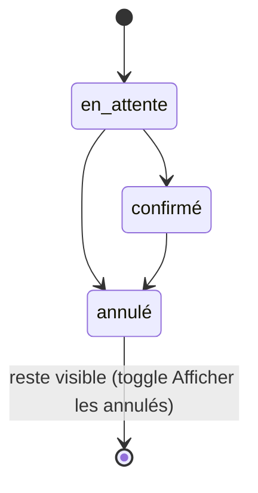
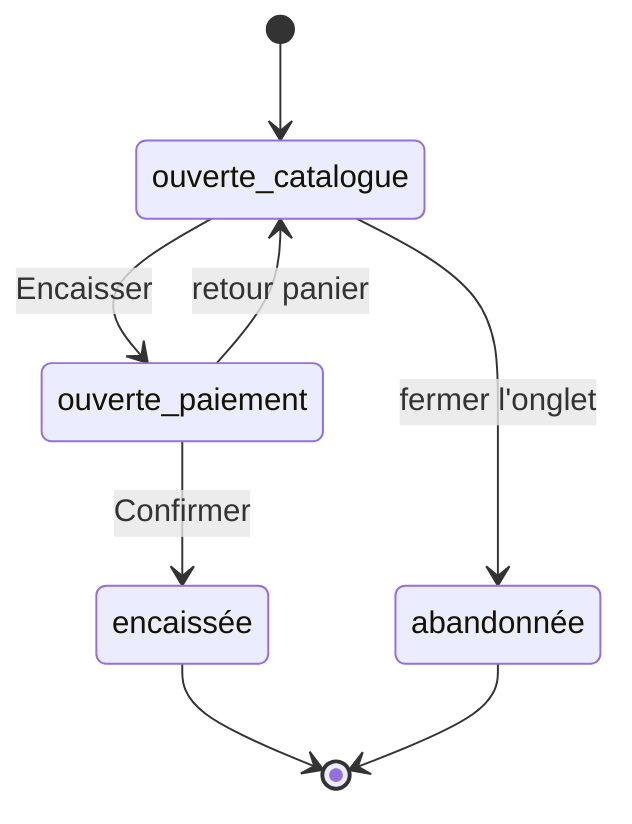
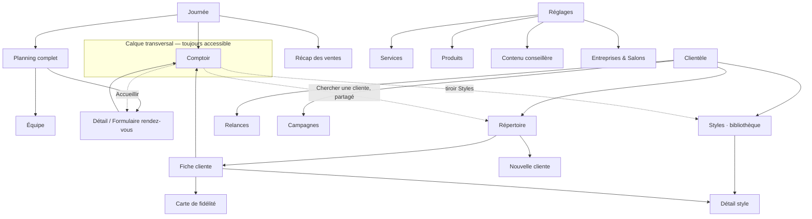

# Userflow — Point de vente (Beauty and Co) — refonte totale (v2)

> Construit avec la technique de *breadboarding* (Shape Up / Ryan Singer) — cf. `/layers-interaction-flow`. Chaque endroit (« lieu ») est nommé de façon significative, chaque affordance porte une destination explicite, chaque état d'échec/vide/annulation est traité comme une étape à part entière.
>
> **Ceci n'est pas une révision de l'existant : c'est une réinvention complète de l'architecture d'interaction.** La v1 de ce document (conservée dans l'historique git) gardait la même carte des 6 modules que l'app actuelle et corrigeait des détails. Cette v2 repart du besoin réel (`PRODUCT.md`, `FEATURES.md`) et redessine l'organisation depuis zéro — **aucun écran de l'app actuelle ne sera réutilisé tel quel** ; les futurs écrans seront construits à partir de ce document, pas l'inverse.
>
> Le **Stock** reste totalement exclu. Toute la portée fonctionnelle listée dans `FEATURES.md` doit se retrouver quelque part ci-dessous — un tableau de couverture en fin de document le vérifie explicitement.

---

## Le changement de modèle

L'app actuelle organise tout en **6 modules à plat, par nom d'objet métier** : Accueil, Planning, Clients, Suivi, Lookbook, Paramètres — chacun un onglet de sidebar, chacun une destination qu'on quitte pour aller ailleurs. Deux symptômes concrets de ce modèle, déjà relevés dans `FEATURES.md` :

- **La Vente est une page comme une autre.** Or `PRODUCT.md` est clair : c'est le terrain quasi permanent de la caissière, interrompu à tout moment par une cliente qui se présente pendant qu'elle consultait autre chose. En faire une page qu'on « quitte » (et qui perd ses autres onglets de vente si on part vers l'Accueil) est un contresens vis-à-vis du métier réel.
- **Suivi, Campagnes et Lookbook sont trois silos qui parlent en réalité de la même chose** — la relation avec une cliente dans le temps — mais ne se répondent jamais entre eux (le Lookbook ne renvoie nulle part, une recommandation de Suivi référence un style qu'on ne peut pas consulter depuis la fiche cliente).

**Principe de la refonte : organiser par rythme d'usage, pas par nom d'objet.**

| Rythme | Ce que c'est | Devient |
|---|---|---|
| **Immédiat** (secondes, interruptible à tout moment) | Identifier une cliente, vendre, encaisser | Un **calque transversal** (« Comptoir »), pas une page — accessible et persistant depuis n'importe quel écran |
| **Quotidien** (consulté par rafales en début/creux de journée) | Qui travaille, qui vient, la tournée de relance du matin | **Journée** — un centre de pilotage du jour, remplace Accueil + Planning + le bandeau Suivi |
| **Relationnel** (consulté en profondeur, pas tous les jours) | Historique cliente, fidélisation, campagnes, styles à proposer | **Clientèle** — fusionne Clients + Suivi + Campagnes + la bibliothèque Lookbook |
| **Rare** (configuration) | Catalogue, salons, contenu de la conseillère | **Réglages** — même esprit qu'aujourd'hui, mais débarrassé des cartes mortes |

La sidebar passe de **6 items à 3** (Journée / Clientèle / Réglages) + un indicateur de vente toujours visible dans l'en-tête, qui n'est pas un item de navigation mais une capacité globale.

---

## Modèle conceptuel (précondition de ce flow)

*Passage formalisé avec `/layers-conceptual-model` — la v2 précédente affirmait ces unifications en une phrase chacune ; ce qui suit fixe leurs attributs, relations (cardinalité + rôle) et états, pour qu'elles soient réellement construisables plutôt que déclarées.*

### Objets

| Objet | Ce que c'est (point de vue utilisatrice) | Relations clés | États |
|---|---|---|---|
| **Cliente** | Une personne identifiée du salon, avec son historique. | `1,1 —— 0,1 Abonnement` · `1,1 —— 0,N Vente` (rôle : cliente de) · `1,1 —— 0,N Rendez-vous` (rôle : bénéficiaire) · `1,1 —— 0,N Relance` (rôle : cible) | — (pas de cycle de vie propre ; une fiche existe ou n'existe pas) |
| **Rendez-vous** | Un créneau réservé pour une cliente avec une praticienne, à une heure donnée. | `N,1 —— 1,1 Cliente` · `N,1 —— 1,1 Praticienne` · `N,1 —— 0,1 Service` · **`1,1 —— 0,1 Vente`** (rôle : *accueil* — le lien qui déclenche le badge « En cours », distinct du statut ci-contre) | `en_attente → confirmé → (annulé)` — Annulé est terminal, jamais supprimé (cf. toggle « Afficher les annulés ») |
| **Vente** (panier) | Une transaction en cours de construction ou déjà encaissée, un onglet du Comptoir. | `1,1 —— 0,1 Cliente` · `1,1 —— 0,N LigneDePanier` · `0,1 —— 1,1 Rendez-vous` (rôle inverse : *origine*, si ouverte via « Accueillir ») | `ouverte(catalogue\|paiement) → encaissée` (terminal, produit un Reçu) **ou** `→ abandonnée` (fermée sans encaissement — nouvel état, nécessaire pour que le Récap des ventes distingue une vraie vente d'un onglet fermé vide) |
| **Style** | Un contenu de la bibliothèque Lookbook : un rendu à montrer ou recommander. | `0,N —— 0,N Relance` (référencé par une recommandation) | — |
| **Relance** | Une action de suivi ciblant une cliente précise (anniversaire, fenêtre de soin, fidélité, reconquête, recommandation). **Unifie ce qui est aujourd'hui 3 formes de carte ad hoc dans le code (`contact`/`pending`/`discount`) en un seul objet à type discriminé** — la vraie décision de modèle derrière l'onglet Relances. | `N,1 —— 1,1 Cliente` · `N,1 —— 0,1 Style` (si recommandation) · `N,1 —— 0,1 Remise` (si reconquête) | `en_attente → envoyée` / `→ ignorée` / (reconquête) `en_attente_autorisation → autorisée → envoyée` |
| **Campagne** | Un message envoyé en masse à une audience de clientes — distinct d'une Relance par sa cardinalité (une audience, pas une cliente). | `1,1 —— 0,N Cliente` (audience, calculée par critère, pas une liste figée) | `brouillon → planifiée → envoyée` (envoyée porte un rapport par destinataire, cf. edge case Campagnes) |

### Carte relationnelle

```mermaid
erDiagram
    Cliente ||--o| Abonnement : "possède"
    Cliente ||--o{ Vente : "cliente de"
    Cliente ||--o{ RendezVous : "bénéficiaire"
    Cliente ||--o{ Relance : "cible"
    Cliente }o--o{ Campagne : "audience"
    RendezVous |o--o| Vente : "origine (Accueillir)"
    RendezVous }o--|| Praticienne : "assigné à"
    Vente ||--o{ LigneDePanier : "contient"
    Relance }o--o| Style : "recommande"
    Style }o--o{ Relance : "référencé par"
```

### États — Rendez-vous et Vente





### Ce que ça change concrètement par rapport à la v2 précédente

- **Rendez-vous** : un seul objet, une seule source de vérité, partagé par Journée (planning) et par le Comptoir. Aujourd'hui ce sont deux mocks disjoints (`APPOINTMENTS_BY_DAY` côté Planning, `TodaysAppointment` côté Vente) — précondition structurelle du pont « Accueillir → Comptoir ». Le badge « En cours » n'est **pas** un statut du Rendez-vous : c'est la présence d'une relation vers une Vente ouverte — les confondre serait l'erreur classique « attribut qui est en fait une relation ».
- **Vente** gagne un état **abandonnée**, absent de la v2 précédente : sans lui, le nouveau Récap des ventes (cf. section Journée) ne peut pas distinguer une transaction réelle d'un onglet ouvert puis refermé vide — un objet ne mérite cet état persistant que parce qu'un vrai écran (le Récap) en a besoin, pas par exhaustivité gratuite.
- **Relance** devient officiellement un seul objet à type discriminé plutôt que 3 formes de cartes qui se ressemblent sans être nommées comme la même chose — la vocabulaire list de `FEATURES.md` (« contact »/« pending »/« discount ») devient un attribut `type` de l'objet, pas trois objets distincts.
- **Cliente** : un seul mécanisme de recherche (« Chercher une cliente »), réutilisé identiquement dans le Comptoir, le Répertoire de Clientèle et le Formulaire de rendez-vous.
  - [ Le jour où cette recherche interroge un vrai backend : timeout ou erreur → message inline + « Réessayer », la saisie déjà tapée reste dans le champ — même comportement partout où le mécanisme est utilisé ]
- **Style** : une bibliothèque de contenu unique, consultée depuis deux points d'entrée (le tiroir Styles du Comptoir, et la fiche cliente référencée par une Relance) — plus un module isolé.

### Vocabulaire encore à confirmer (ce passage en a trouvé un de plus)

- **« Cliente » vs « client »** : ce document choisit systématiquement le féminin (cohérent avec la clientèle très majoritairement féminine du salon), alors que `CONTEXT.md` liste encore « Client » comme terme « à définir ». Ce n'est pas neutre : à fixer via `/grill-with-docs` en même temps que Journée/Clientèle/Comptoir/Accueillir, pas à laisser trancher implicitement par l'usage de ce document.

---

## Principes directeurs

1. **Un seul poste, tactile, desktop uniquement.** Aucune variante mobile/responsive. Cibles primaires ≥ 44px, feedback de pression visible, pas d'affordance hover-only.
2. **La vente ne se quitte jamais, elle se replie.** Voir « Calque transversal — Comptoir » ci-dessous : c'est le changement le plus structurant de cette refonte.
3. **Un seul mécanisme par capacité transverse** : une seule recherche cliente, un seul patron de confirmation destructrice, un seul patron de validation de formulaire, un seul composant d'état vide — réutilisés partout plutôt que réimplémentés section par section.
4. **Aucun stub silencieux.** Une capacité pas encore prête le dit visuellement (grisée, « Bientôt disponible ») ou n'apparaît pas du tout — jamais un clic qui ne produit rien.
5. **Vocabulaire fixé par `CONTEXT.md`** : « rendez-vous » toujours en toutes lettres (jamais « RDV » hors abréviation d'affichage dans une grille étroite). Les noms des 3 sections (Journée / Clientèle / Réglages) et le nom « Comptoir » sont de nouvelles décisions de vocabulaire à faire mûrir via `/grill-with-docs` avant de les considérer figées.
6. **Aucun échec silencieux d'un mécanisme transverse.** Paiement, envoi de message, sauvegarde, recherche cliente : un échec réseau ou service garde toujours la saisie déjà faite, affiche une erreur explicite et propose un « Réessayer » — jamais un écran qui ne réagit pas, jamais une saisie perdue parce que l'appel derrière a échoué.
7. **Le ton rassure, jamais n'accuse.** Chaque confirmation ou erreur s'adresse à une réceptionnière non technicienne, souvent sous pression avec une cliente en face : phrases complètes et concrètes, jamais de code d'erreur ni de jargon système, toujours l'action suivante à faire clairement énoncée. Pas « Erreur : code invalide » mais « Ce code n'est pas reconnu — vérifiez-le ou continuez sans remise ». Pas un silence pendant un scan ou un enregistrement, mais un état visible (« Recherche en cours… », « Enregistrement… »).

---

## Conventions de spécification UI

*À partir d'ici, chaque lieu porte un bloc **Spécification UI** : Structure (régions de l'écran), Composants (mappés au design system réel), Contenu, États. Objectif explicite : construire l'écran sans avoir à le deviner, ni à revoir cette conversation.*

**Le design system réel** (`components/ui/`, organisé en atoms/molecules/organisms — vérifié dans le code au moment d'écrire ceci, pas supposé) couvre déjà l'essentiel :
- **Atoms** : `Button` (variants brand/dark/outline/lilac/success/info/danger/danger-outline), `Badge` (success/warning/error/info/vip/gold/silver/brand/dark/neutral), `Card`, `Avatar`, `IconButton`/`CloseButton`, `TextInput`, `Textarea`, `Select`, `SearchInput`, `Switch`, `Checkbox`, `HeroNumber`, `RoundStepButton`, `ProgressBar`, `PhotoPlaceholder`, `Tooltip`, `Spinner`, `Skeleton`, `Separator`, `FieldLabel`, `Logo`.
- **Molecules** : `Dialog` (coquille overlay + panneau centré), `ConfirmDialog` (bâti sur `Dialog`, exactement le patron de confirmation unique visé par les Principes directeurs), `Toast` (bannière basse auto-dismiss), `Pills`, `SegmentedToggle`, `Tabs`, `Accordion`, `Breadcrumb`, `DropdownMenu`, `Popover`, `RadioGroup`, `Stepper`, `StatTile`/`StatTileRow`, `PersonCard`, `EmptyState`, `Field`, `Alert` (bannière persistante, pas un toast).
- **Organisms** : `PageHeader` (titre + sous-titre + retour + action), `Toolbar` (recherche + pills de filtre + action, la forme récurrente au-dessus d'une liste), `DataTable` (grille bordée pour des listes structurées, sans zébrage).

**Composants à créer — n'existent pas encore, à ne pas confondre avec le catalogue ci-dessus :**
- **`SaleTrayTrigger`** (organism) : la pastille Comptoir de l'en-tête (icône + « N ventes · total F »), cliquable, portée par un `Badge` variant `dark` pour le total. N'existe nulle part aujourd'hui — l'app actuelle n'a pas d'indicateur persistant.
- **`ComptoirPanel`** (organism) : le panneau plein écran du Comptoir déployé. **Ce n'est pas un `Dialog`** — `Dialog` est une coquille centrée avec overlay sombre pensée pour un contenu qui reste secondaire à l'écran du dessous ; le Comptoir, lui, doit occuper tout le viewport comme un changement de mode, pas comme une interruption. À construire comme un conteneur `fixed inset-0` propre, avec son propre header interne (onglets de vente + « Replier ») plutôt que de détourner `Dialog`.
- **`RelanceCard`** (molecule) : une carte de Relance à type discriminé (`contact`/`pending`/`discount`) — généralise le `SuiviCard` actuel maintenant que Relance est un objet unique (cf. Modèle conceptuel). Composée de `PersonCard` (identité) + `Badge` (retard/statut) + zone d'action conditionnelle selon le type.
- **Extension de `Toast`** : ajouter un slot `action?: { label: string; onClick: () => void }` pour porter le bouton « Annuler » du patron « toast réversible » (Relances, Comptoir) — le `Toast` actuel n'a que `message`/`onDismiss`, sans emplacement pour une action.
- **`AppointmentTimelineRow`** (molecule) : une ligne de la Chronologie du jour (heure + `PersonCard` + `Badge` de statut + `Button` « Accueillir »/« En cours ») — plus condensée que la grille horaire complète du Planning, qui reste `AppointmentBlock` (déjà existant conceptuellement dans le code actuel, à conserver pour Planning complet).
- **`DatePicker`** (atom) : un vrai sélecteur de date calendrier. Le formulaire Nouvelle cliente utilise aujourd'hui un `TextInput` libre pour l'anniversaire (`FEATURES.md` le signale comme non fonctionnel malgré l'icône décorative) — cette refonte en fait un vrai composant, à construire.
- **`FileUpload`** (atom) : un vrai sélecteur de fichier avec validation taille/format inline. Remplace les 2 zones actuellement purement décoratives (photo produit, slots Photos de référence) — un seul composant, pas deux implémentations proches.

**Audit tactile complet des 34 fichiers de `components/ui/` — fait, corrigé dans le code, pas seulement noté ici.**

*Le premier passage sur ce document n'avait vérifié que 4 composants et s'était arrêté là. Un second passage a relu l'intégralité du catalogue (tous les atoms/molecules/organisms existants, plus les 6 composants « à créer » listés ci-dessus, entre-temps déjà construits par une autre session à partir de cette même spec) et corrigé directement le code partout où le Principe directeur 1 n'était pas respecté. Détail des 13 corrections faites :*

| Composant | Trouvé | Corrigé |
|---|---|---|
| `Button` (atom) | Aucun retour de pression (`hover:opacity-90` seul — invisible au tap) ; désactivé = `opacity-40` générique, contraire à la Règle du Disabled-Is-Not-Invisible de `DESIGN.md` sur les variantes claires | `active:scale-[0.97]` ; désactivé = fond gris uni lisible, plus de wash translucide |
| `CloseButton` | `size-9` (36px), hover-only | `size-11` (44px) + `active:scale-90` |
| `Checkbox` | Zone de frappe = la case de 20px seule (sans label) ; ligne sans hauteur minimale (avec label) | Zone invisible 44px par marge négative ; ligne `min-h-11` |
| `Switch` | Le bouton entier ne mesure que 24px de haut (la piste = toute la cible) | Bouton 44×44px, piste visuelle inchangée, centrée dedans |
| `Select` (options du menu) | Lignes ~40px (`py-2.5`) | `py-3` + `min-h-11` → 44px |
| `Pills` | `py-2` (~36px), aucun retour de pression | `py-3` (44px) + `active:scale-[0.97]` |
| `SegmentedToggle` | `py-2.5` (~40px) | `py-3` (44px), gardait déjà `active:scale` |
| `Tabs` | `py-2` (~36px), aucun retour de pression | `py-3` (44px) + `active:scale-[0.97]` |
| `PersonCard` | Carte cliquable sans retour de pression | `active:scale-[0.97]` |
| `AppointmentTimelineRow` (nouveau) | Même trou que `PersonCard` | `active:scale-[0.98]` |
| `DataTable` | Lignes cliquables en `hover:bg` seul, aucune trace au tap | `active:bg` ajouté (pas de scale — casserait visuellement une ligne pleine largeur) |
| `PageHeader` (bouton retour) | Chevron nu `size-8` (32px), sans bordure ni libellé — contredit **littéralement** la règle déjà écrite dans `DESIGN.md` (« icône + label, bordé, ≥44px ») | Vrai bouton bordé 44px, icône + « Retour », `active:scale` |
| `DatePicker` (nouveau) | Flèches de mois `size-8`, cellules de jour `size-9` (36px) | Flèches et cellules `size-11` (44px), popover élargi (`w-72` → `w-[23rem]`) pour les faire tenir |
| `FileUpload` (nouveau) | Bouton de suppression de fichier `size-6` (24px) | Zone de frappe invisible 44px par marge négative, glyphe visuel inchangé (une icône 44px écraserait la puce compacte) |

**Restent des cas particuliers, documentés plutôt que forcés dans le même moule :**
- **`Tooltip`** (`atoms/tooltip.tsx`) est un composant Radix **déclenché au survol/focus** — pas d'équivalent tactile. Ce n'est pas un bug de dimensionnement à corriger comme les autres : c'est une classe entière d'usage à proscrire. **Ne jamais l'utiliser pour une information nécessaire au geste** (pourquoi un bouton est désactivé, une définition de champ) — partout dans ce document, ce cas passe par un texte visible en permanence (`FieldLabel`, même patron que l'aide sous « Encaisser » désactivé). Réservé à une info strictement redondante avec un `aria-label` déjà présent.
- **`Popover`**/**`DropdownMenu`** déclenchent correctement au tap (Radix, pas du survol) — pas de faute de principe. `DropdownMenu` (`py-2.5` ≈ 40px par item) reste légèrement sous 44px mais sert un menu rare (identité, actions secondaires) plutôt qu'un geste répété — laissé tel quel plutôt que retouché par principe ; à corriger si un usage fréquent apparaît.
- **`Stepper`/`RoundStepButton`** étaient déjà corrects (`size-11` en mode par défaut, `active:scale-[0.94]`) — cités ici pour mémoire, aucune correction nécessaire : le composant qui avait le mieux anticipé le tactile dans tout le catalogue.

---

## Carte des lieux



---

## Calque transversal — Comptoir

*Ce n'est le job story de personne en particulier : c'est la capacité qui traverse tous les job stories ci-dessous. Décrite une seule fois ici.*

```
En-tête de l'app (visible sur TOUTE section : Journée, Clientèle, Réglages)
- Pastille « Comptoir » : réduite = juste le nombre de ventes ouvertes + le total cumulé (ex. « 2 ventes · 87 000 F ») ; vide = « Comptoir » seul, sans chiffre
- Tap sur la pastille → déploie le Comptoir en plein écran, par-dessus la section en cours
- Le Comptoir déployé peut être **replié** (et non « quitté ») → retour instantané à la section qui était affichée dessous, la pastille réapparaît dans l'en-tête avec l'état à jour
  - le repli **préserve l'état interne exact** du Comptoir : onglet actif, étape (Catalogue/Panier/Paiement/Reçu) et tiroir Styles éventuellement ouvert — repli et redéploiement ne sont jamais un reset ; redéployer via la pastille rouvre exactement là où on l'a laissé, y compris en plein milieu d'un Paiement (le poste est interruptible à tout moment, le Comptoir doit l'être tout autant)
- Bloc identité (avatar, nom, rôle) → menu, seul point d'entrée de « Déconnexion » (même patron de confirmation que partout ailleurs, plus le `window.confirm` natif actuel) ; « Mon Profil » y renvoie vers Réglages → Prochainement tant qu'aucune vraie session n'existe
[ Naviguer entre Journée / Clientèle / Réglages ne ferme jamais un onglet de vente ouvert — corrige la perte des autres ventes actuelle en quittant vers l'Accueil ]
[ Fermeture accidentelle de l'onglet navigateur, ou crash, en pleine vente (tout l'état vit en mémoire React, sans backend — cf. `FEATURES.md`) → au rechargement, message explicite plutôt qu'un Comptoir vide silencieux : « Vos ventes en cours n'ont pas pu être conservées, merci de recommencer » ; un avertissement navigateur standard se déclenche déjà si on ferme l'onglet pendant qu'une vente est ouverte, mais ne protège pas d'un crash — une persistance locale minimale (stockage navigateur) reste une décision ouverte, pas un détail à négliger vu la fréquence d'un poste utilisé toute la journée ]

Comptoir (déployé)
- onglets de vente en haut (une vente = un onglet), « + » pour en ouvrir une nouvelle, fermeture d'un onglet avec panier non vide → Confirmation (le patron de dialogue unique de l'app)
- « Replier » (et non « Retour » / pas de flèche vers une page parente puisque le Comptoir n'a pas de parent — il flotte au-dessus de tout)
- Cliente : Chercher une cliente (mécanisme unique, cf. Modèle conceptuel) ou « Scanner » ou « + Nouvelle cliente »
  - correspondance avec un rendez-vous du jour + panier vide → panier auto-rempli, message explicite dans le panier (« Prestations du rendez-vous de 14h ajoutées »)
- bascule Services / Produits, recherche, catégories, grille de tuiles → ajout au panier (incrémente si déjà présent)
- tiroir **Styles** (bibliothèque Lookbook) accessible depuis le Comptoir pendant la conversation avec la cliente → voir un style, « Ajouter au panier » directement si c'est une prestation du catalogue
- panier : stepper qty, retrait de ligne, assignation praticien·ne, section Remise (code cadeau + scan, points fidélité, code manager — erreur inline si code invalide)
  - un seul code cadeau actif à la fois : en appliquer un second **remplace** le premier avec un message inline explicite (« remplace le code XXX ») — jamais l'écrasement silencieux d'aujourd'hui
  - [ Carte cadeau déjà utilisée ou expirée → message distinct d'un simple code non reconnu : « Cette carte a déjà été utilisée » / « Cette carte a expiré le [date] », jamais le même texte générique qu'une faute de frappe — un message qui semble accuser la cliente en face serait un mauvais moment à vivre au comptoir ]
- « Encaisser » (désactivé + texte d'aide tant que panier vide ou cliente non identifiée) → Paiement

Scanner (dialogue, caméra réelle — un seul lieu, réutilisé identification cliente ET code cadeau)
- cadre de visée, erreur caméra affichée si besoin
- « Simuler la détection » (explicitement étiqueté mode démo) → pré-remplit le champ d'origine (cliente ou code cadeau), ne l'applique jamais à l'aveugle sans étape de confirmation
- [ Caméra refuse l'accès en pleine vente (scan cliente ou carte cadeau) → le panier et l'onglet en cours restent strictement intacts ; message rassurant (« Caméra indisponible — utilisez la recherche ou la saisie manuelle ») avec le champ de saisie déjà au premier plan, jamais un blocage qui force à fermer l'onglet ]
- [ Cliente scannée sans aucune correspondance → pas le texte froid « aucune correspondance » seul : CTA direct « Créer une nouvelle cliente » qui ouvre Nouvelle cliente pré-remplie du numéro lu si disponible, retour au Comptoir avec la cliente déjà sélectionnée une fois créée — le parcours de récupération est aussi direct que la recherche elle-même ]

Paiement (dans le Comptoir déployé)
- 4 modes (Wave / Orange Money / Espèces / Carte), sélection simple ou mixte (2 modes, jamais deux fois le même)
- rendu de monnaie calculé uniquement si Espèces est impliqué ; égalité exacte exigée sur les rails 100 % digitaux
- [ Répartition mixte qui ne tombe jamais juste (erreur de saisie) → « Confirmer » reste désactivé, l'écart restant s'affiche en direct (« reste 500 F à répartir »), un bouton « Recommencer la répartition » remet les deux montants à zéro sans perdre les 2 modes choisis ni renvoyer au panier — se tromper ne doit jamais coûter de tout reprendre depuis le catalogue ]
- « Confirmer » → Reçu

Reçu (dans le Comptoir déployé)
- récap complet, points fidélité réellement écrits dans le profil cliente
- « Imprimer le reçu »
  - [ Impression impossible (imprimante hors ligne/absente) → le reçu reste affiché à l'écran, un bouton « Réessayer l'impression » remplace l'échec silencieux, et « Nouvelle vente »/« Replier » restent utilisables sans dépendre de l'impression — la vente est déjà encaissée, un souci d'imprimante ne doit jamais donner l'impression que la vente elle-même a échoué ]
- « Accueillir un nouveau rendez-vous maintenant » → Journée, formulaire de rendez-vous pré-rempli avec cette cliente + le 1er service du panier
- « Nouvelle vente » → ferme cet onglet, garde les autres ouverts
- « Replier » → retour à la section qui était affichée avant d'ouvrir le Comptoir, pastille d'en-tête mise à jour
```

**Ce que ce calque résout structurellement** : plus de « page Vente » qu'on quitte et qui perd son état ; un seul endroit pour scanner un code (client ou cadeau) ; un pont direct et réutilisable vers le Lookbook et vers la prise de rendez-vous.

**Décisions actées** : le rendu de monnaie sur les paiements impliquant Espèces est une **capacité nouvelle** (absente aujourd'hui, où l'égalité exacte est exigée même en cash) ; l'auto-remplissage du panier depuis un rendez-vous devient explicite (message dans le panier, plus un effet silencieux) ; le scan (client ou carte cadeau) ne s'applique plus jamais sans étape de confirmation, y compris pour la carte cadeau qui aujourd'hui saute cette étape ; un reçu imprimable existe enfin malgré son nom.

### Spécification UI — Comptoir

**En-tête de l'app**
- Structure : barre fixe en haut, présente au-dessus des 3 sections. Zone gauche = rien (la sidebar porte déjà le logo) ; zone droite = pastille Comptoir + menu identité.
- Composants : `SaleTrayTrigger` (nouveau, cf. Conventions) pour la pastille ; `DropdownMenu` (trigger = `Avatar` + nom) pour le menu identité, avec deux `DropdownMenuItem` : « Mon Profil » (→ Réglages/Prochainement) et « Déconnexion » (ouvre `ConfirmDialog`).
- Contenu pastille : icône + `"{n} ventes · {total} F"` si ≥1 vente ouverte (format FCFA `Intl.NumberFormat("fr-FR")`, jamais `€`) ; sinon juste le libellé « Comptoir » sans nombre — ne jamais afficher « 0 vente ».

**Comptoir (déployé)** — `ComptoirPanel` (nouveau)
- Structure : header interne du panneau (onglets de vente + bouton « Replier », `IconButton` avec une icône de repli, pas la `CloseButton` en croix qui suggère une fermeture destructrice) ; corps en 2 colonnes desktop (catalogue à gauche ~65%, panier à droite en colonne fixe `sticky`) — reprend la mise en page à 2 colonnes déjà validée par `DESIGN.md`, pas une réinvention visuelle, seulement une réinvention de son conteneur.
- Onglets de vente : `Pills` détourné en mode « tabs fermables » n'est pas le bon composant (Pills n'a pas de bouton de fermeture par option) — garder le composant `sale-tabs` actuel (déjà bien conçu selon `FEATURES.md`, shape « onglets de navigateur » délibérément différente des Pills) plutôt que de le remplacer par un composant générique qui perdrait cette distinction visuelle voulue.
- Cliente : champ `TextInput` avec icône loupe + résultats dans un `Popover` ancré au champ (liste de `PersonCard`) plutôt qu'une liste toujours visible — le mécanisme « Chercher une cliente » unique doit être un seul composant composite (`TextInput` + `Popover` + liste de `PersonCard`), réutilisé identiquement en Répertoire et Formulaire rendez-vous, jamais réimplémenté trois fois avec des styles proches mais distincts.
- Bascule Services/Produits : `SegmentedToggle` (pas `Pills` — c'est un changement de catalogue, pas un filtre, cf. le commentaire du composant lui-même).
- Catégories : grille de `Card` cliquables (icône + nom + compteur), Pills pour les sous-catégories une fois une catégorie choisie.
- Panier : `Card` contenant une liste de lignes ; chaque ligne = nom + prix (`FieldLabel` variant body) + `Stepper` (qty) + `Select` (assignation praticien·ne) + `IconButton` (icône poubelle, `aria-label="Retirer {name} du panier"`).
- Remise/Code cadeau : section repliable dans un `Accordion` à un seul item (ou un simple disclosure `<details>` stylé — `Accordion` convient si son API accepte un seul panneau) ; `Badge` variant `success` "Actif" affiché sur le titre du panneau quand fermé et qu'une remise est en cours.
- Encaisser : `Button` variant `brand`, pleine largeur, `disabled` tant que panier vide ou cliente absente — texte d'aide sous le bouton en `FieldLabel` quand désactivé (jamais un simple `opacity-40`, conformément à la Règle du Disabled-N'est-pas-Invisible de `DESIGN.md`).

**Scanner** — `Dialog` (celui-ci reste un vrai Dialog, centré, puisque c'est une interruption ponctuelle et non un changement de mode)
- Contenu : flux vidéo réel (`<video>`) derrière un cadre de visée SVG existant, `Alert` variant `error` si la caméra est refusée, `Button` variant `dark` « Simuler la détection » sous une étiquette explicite de mode démo.

**Paiement** (dans `ComptoirPanel`)
- `HeroNumber` pour le « Total à payer » (size `md`/`lg`, centré).
- Grille 2×2 de `Card` cliquables pour les 4 modes.
- `Checkbox` « Paiement mixte », panneau conditionnel avec 2× `TextInput` type `number` + `Pills` pour choisir le 2ᵉ mode.
- Écart de répartition affiché en `FieldLabel` + `Badge` variant `error`/`success` selon l'état de validité.

**Reçu** (dans `ComptoirPanel`)
- `Alert` variant `success` en bandeau haut (ou un bloc dédié aux formes décoratives déjà spécifiées dans `DESIGN.md` — l'`Alert` générique n'a pas ces cercles décoratifs, à traiter comme un habillage visuel propre à cet écran plutôt que de forcer `Alert` à les porter).
- `HeroNumber` pour le total, liste de lignes en texte simple, `StatTileRow`/`StatTile` pour la section Fidélité (points gagnés / solde).
- Barre d'actions basse fixe : `Button` outline « Imprimer le reçu », `Button` brand « Nouvelle vente », `Button` outline « Replier ».

---

## Section Journée

*Écran d'atterrissage par défaut de l'app. Remplace l'ancien Accueil (dashboard statique) et absorbe le Planning du jour + le bandeau Suivi.*

```
Journée
- Chronologie du jour : rendez-vous du jour groupés par praticien·ne (vue condensée, pas la grille horaire complète)
  - chaque rendez-vous → « Accueillir » (si l'heure approche/est passée) → Comptoir déployé, nouvel onglet pré-rempli avec la cliente + ses prestations — LE point d'entrée principal d'une vente liée à un rendez-vous, pas un effet caché déclenché depuis une recherche cliente
  - un rendez-vous déjà accueilli (un onglet lui est déjà associé) affiche un badge « En cours » à la place du bouton « Accueillir » ; le retaper **bascule** sur l'onglet existant au lieu d'en ouvrir un doublon — répond au cas d'un double-accueil sur le **même** rendez-vous (double-tap, ou deux membres de l'équipe qui cliquent chacun de leur côté) ; deux rendez-vous **différents** accueillis au même instant ne posent eux aucun conflit, chacun ouvrant son propre onglet puisque le Comptoir est multi-onglets par construction
  - tap sur un rendez-vous → Détail / Formulaire rendez-vous
- Widget « Tournée du matin » (résumé) : nombre de messages prêts, CTA « Valider & envoyer » directement ici (pas besoin d'aller dans Clientèle pour le geste le plus fréquent), lien « Voir le détail » → Clientèle → Relances — ce widget est la réponse structurelle au risque d'enterrer la tournée du matin sous un onglet Clientèle : le geste quotidien à haute fréquence (valider & envoyer en bloc) reste à 1 tap depuis l'écran d'atterrissage, exactement comme le lien direct « Suivi » de la sidebar actuelle ; seul le traitement carte par carte (autoriser une remise, ignorer un cas, marquer un RDV pris) se déplace d'1 tap supplémentaire vers Relances — un coût acceptable car ce sont des exceptions, pas le geste répété chaque matin
- Résumé du jour : total réellement encaissé aujourd'hui (calculé depuis les ventes à l'état *encaissée* de la session), nombre de rendez-vous du jour — remplace les cartes « Revenus »/« Rendez-vous » figées ou mortes de l'ancien Accueil
  - « Voir le récap complet » → **Récap des ventes** (lieu retrouvé en confrontant les captures d'écran originales du design de référence à `FEATURES.md` : la maquette d'origine prévoyait une action rapide « Récap ventes » que ni le code actuel ni la v2 précédente de ce document ne couvraient — un vrai trou, maintenant comblé)
- « Planning complet » → Planning complet (semaine, équipe, jours au-delà d'aujourd'hui)
[ Aucun rendez-vous aujourd'hui → état vide avec un raccourci direct « Nouveau rendez-vous » ]
[ Minuit passé avec une vente encore ouverte dans le Comptoir → la vente reste rattachée à la Journée où elle a été ouverte, jamais une bascule silencieuse vers le lendemain ; le Résumé du jour se fige à minuit et une nouvelle Journée démarre à zéro, la vente à cheval vient s'ajouter au total du jour d'origine une fois encaissée — frontière claire, pas un cas laissé au hasard de l'implémentation ]

Planning complet
- « Aujourd'hui » (visible seulement si on a navigué ailleurs) → revient à la semaine/jour réels, raccourci conservé de l'existant
- sélecteur de semaine (◀/▶) + 7 jours cliquables
- toggle grille horaire par praticien·ne / vue Équipe
- filtres Entreprise / Salon réellement branchés, masqués s'il n'y a rien à filtrer
- toggle « Afficher les annulés » : rendez-vous annulés visibles en surimpression atténuée sur la grille — c'est ici que vit « l'historique » des annulations promis en Détail rendez-vous, pas un écran séparé
- clic case horaire vide ou « Nouveau rendez-vous » → Formulaire rendez-vous
- clic bloc existant → Détail rendez-vous

Détail rendez-vous (dialogue)
- « Confirmer » (si en attente), « Accueillir maintenant » (raccourci direct vers le Comptoir, identique au geste depuis la Chronologie du jour), « Modifier » → Formulaire, « Annuler » → Confirmation, statut passe à Annulé et reste consultable via le toggle « Afficher les annulés » du Planning complet (pas de suppression silencieuse)
- [ Annuler un rendez-vous dont la cliente est déjà accueillie (un onglet Comptoir lui est déjà lié) → la Confirmation porte un avertissement spécifique (« Un onglet de vente est ouvert pour ce rendez-vous — l'annuler ne le fermera pas ») au lieu du texte générique, pour ne jamais laisser croire que l'annulation referme aussi la vente en cours ]

Formulaire rendez-vous (création/édition)
- Cliente* (Chercher une cliente, mécanisme unique), Service*, Praticien·ne* (filtrée aux personnes travaillant ce jour), Heure de début*, Durée*, Statut
- créneaux déjà pris visuellement indisponibles dans le sélecteur d'heure ; conflit résiduel détecté à la soumission → erreur inline

Équipe (annuaire, secondaire par rapport à la Chronologie)
- filtre par rôle (Coiffeuse / Esthéticienne / Accueil — le rôle Stock disparaît avec le module retiré)
- pastille « travaille » relative au **jour réellement affiché** (plus le libellé « aujourd'hui » figé qui ment dès qu'on a navigué ailleurs dans le sélecteur de semaine)
- clic praticien·ne → Planning complet filtré sur cette personne ; carte Accueil non cliquable, visuellement distincte
- « Marquer indisponible aujourd'hui » sur une carte praticien·ne (absence de dernière minute) → ses rendez-vous du jour affichent un badge « Praticien·ne absente » dans la Chronologie et sur la grille Planning complet ; taper « Accueillir » sur l'un d'eux impose de choisir une remplaçante avant d'ouvrir le Comptoir — jamais un accueil qui envoie silencieusement la cliente vers une personne qui n'est pas là

Récap des ventes  (nouveau lieu — absent du code actuel, retrouvé dans le design de référence)
- période : Aujourd'hui / Cette semaine / Ce mois / période personnalisée
- total encaissé, nombre de ventes, panier moyen ; répartition par mode de paiement (Wave / Orange Money / Espèces / Carte) ; répartition par praticien·ne
- liste des ventes de la période (chacune : heure, cliente, total, mode de paiement) → clic ouvre le Reçu correspondant en lecture seule (même écran que celui produit à l'encaissement, jamais une resaisie)
- ventes *abandonnées* de la période comptées à part, jamais mélangées au chiffre encaissé (cf. Modèle conceptuel — c'est précisément pourquoi cet état existe)
[ Aucune vente sur la période → état vide, pas un tableau à zéro sur toutes les lignes ]
```

**Décisions actées** : le geste « Accueillir » depuis la Chronologie du jour devient LE chemin principal pour une vente liée à un rendez-vous (pas un simple effet de bord de la recherche cliente comme en v1) ; annuler conserve un statut Annulé ; le résumé du jour reflète des données réelles ; l'absence de dernière minute d'une praticienne a désormais un geste dédié (« Marquer indisponible ») plutôt que de rester un trou du modèle qui laisserait « Accueillir » emmener une cliente vers une chaise vide.

### Spécification UI — Journée

**Journée (atterrissage)**
- Structure : `PageHeader` (title « Journée », pas de `backHref` — c'est la racine) ; puis 3 blocs empilés pleine largeur : Chronologie, widget Tournée du matin, `StatTileRow` (Résumé du jour) ; `Button` outline « Planning complet » en pied de page.
- Chronologie : liste de `AppointmentTimelineRow` (nouveau, cf. Conventions) groupée par praticienne (un `FieldLabel` variant eyebrow par groupe) — pas de `DataTable` ici, c'est une liste d'actions à prendre, pas des données à comparer en colonnes.
- Badge « En cours » : `Badge` variant `dark`, remplace le `Button` « Accueillir » in situ dans `AppointmentTimelineRow` (même emplacement, contenu différent selon la relation Vente présente ou non — cf. Modèle conceptuel).
- Widget Tournée du matin : `Card` contenant `FieldLabel` eyebrow + `HeroNumber` (value = messages prêts) + texte de statut + `Button` variant `dark` « Valider & envoyer » (ouvre `ConfirmDialog`) + `Button` variant outline size compact « Voir le détail ».
- Résumé du jour : `StatTileRow` de 2 `StatTile` (Encaissé aujourd'hui, Rendez-vous du jour) + lien texte « Voir le récap complet » vers Récap des ventes.
- État vide (aucun RDV) : `EmptyState` avec action `Button` « Nouveau rendez-vous ».

**Planning complet**
- `PageHeader` avec action = `Button` outline « Aujourd'hui » (visible conditionnellement).
- Sélecteur de semaine : `IconButton` ×2 (chevrons) encadrant le libellé du mois.
- 7 jours : rangée de `Button`-toggle (pas `Pills` — chaque jour porte 2 lignes, jour+numéro, une forme que `PillOption` ne prévoit pas nativement ; garder le composant dédié `week-day-selector` déjà présent dans le code).
- Toggle grille/Équipe : `SegmentedToggle`.
- Filtres Entreprise/Salon : 2× `Select`.
- Toggle « Afficher les annulés » : `Switch` seul (jamais le doublon Switch+bouton relevé ailleurs dans `FEATURES.md`).
- Grille horaire : composant dédié existant (`AppointmentBlock` en grille CSS) — ni `DataTable` ni `Card` ne conviennent à un positionnement par créneau, c'est un composant spécialisé à conserver tel quel.

**Détail rendez-vous** — `Dialog` (`role="alertdialog"` non requis ici, c'est informatif avant d'être destructeur)
- `Badge` de statut, bloc info sur `Card` fond doux, boutons d'action en bas (`Button` variants success/outline/danger-outline selon l'action).
- Annulation → `ConfirmDialog` avec `description` portant l'avertissement spécifique si une Vente est liée (cf. edge case).

**Formulaire rendez-vous** — `Dialog`
- Chaque champ dans un `Field` (label + contenu) : `TextInput`+`Popover` pour Cliente (mécanisme unique), `Select` pour Service/Praticien·ne/Heure, `TextInput type=number` pour Durée, `RadioGroup` ou `Pills` pour Statut.
- Créneaux indisponibles : options du `Select` Heure rendues `disabled` plutôt que retirées (la personne doit voir qu'un créneau existe mais est pris, pas croire qu'il n'existe pas).
- Erreur de conflit résiduelle : `Alert` variant `error` inline au-dessus des boutons de pied.

**Équipe**
- `Toolbar` avec seulement des `filters` (Pills par rôle), pas de recherche ici (l'annuaire est court).
- Grille de `PersonCard` (`online` prop pour la pastille « travaille ce jour-là »), `Badge` de rôle.
- « Marquer indisponible » : `IconButton` discret sur la carte (pas un bouton pleine largeur — c'est une exception rare, elle ne doit pas concurrencer visuellement le tap principal « ouvrir le planning »).

**Récap des ventes**
- `Toolbar` avec un `Select`/`Pills` de période en guise de "filters" et une action `Button` outline « Exporter » si pertinent plus tard (pas dans ce périmètre).
- `StatTileRow` (total, nb ventes, panier moyen) au-dessus d'une `DataTable` (colonnes : heure, cliente, total, mode de paiement) — ici `DataTable` est le bon choix, contrairement à la Chronologie : ce sont des données à comparer ligne à ligne, pas des actions à prendre.
- Ligne cliquée → `Dialog` réutilisant l'affichage du Reçu en lecture seule (pas un composant distinct dupliqué).

---

## Section Clientèle

*Fusionne l'ancien Clients + Suivi + Campagnes + la bibliothèque Lookbook, en 4 onglets d'une même section — parce que ce sont, au fond, quatre façons de regarder la même chose : la relation avec une cliente dans le temps.*

*Note de discipline de breadboard : Clientèle n'est pas un seul job story à 9 lieux — c'est 4 job stories distincts (Répertoire→Fiche→Nouvelle cliente→Fidélité ; Relances ; Campagnes ; Styles→Détail) qui partagent une même porte d'entrée et un même vocabulaire. Chacun reste sous la barre des 5-6 lieux. Ne pas lire le graphe Clientèle du plan des lieux comme une seule route à suivre de bout en bout.*

```
Clientèle  (4 onglets : Répertoire · Relances · Campagnes · Styles)

Répertoire
- Chercher une cliente (mécanisme unique) + filtres (Toutes / Nouvelles / Historique / VIP)
- « + Nouvelle cliente » → Nouvelle cliente
- clic carte → Fiche cliente
[ Aucun résultat → état vide + « Réinitialiser les filtres » ]

Nouvelle cliente (formulaire, ouvert depuis le Répertoire OU depuis le Comptoir)
- Identité (Prénom*, Nom*, Téléphone*, WhatsApp, Email, Adresse, Profession, Anniversaire — vrai sélecteur de date), Profil beauté
- détection de doublon sur le téléphone, avertissement inline avec lien direct « Voir la fiche existante » — pas qu'un texte qu'on peut ignorer sans savoir qui est déjà là
  - [ Deux vraies clientes différentes partagent le même numéro (foyer, famille) → « Créer quand même » reste possible après avoir vu la fiche existante ; la détection prévient, elle ne bloque jamais un cas réel ]
- « Créer » → persiste réellement → Fiche cliente ; si ouvert depuis le Comptoir, retour au Comptoir avec la cliente déjà sélectionnée

Fiche cliente
- Identité, QR (motif démo tant que la lecture réelle n'est pas tranchée), « Imprimer carte », contact (désactivé + explication si coordonnée absente)
- « Nouvelle vente pour cette cliente » → Comptoir déployé, nouvel onglet, cliente déjà sélectionnée
- Coordonnées avec « Modifier » réellement câblé
- Stats, dernière visite, historique réel des visites (pas un état vide permanent)
- Abonnement : section toujours visible, état vide honnête si absent ; « Utiliser » un crédit décrémente réellement (le bouton se désactive dès le premier tap le temps de l'écriture — un double-tap nerveux ne décompte jamais deux fois) ; « Prestataire préférée » cliquable → Planning complet filtré sur cette personne
- Recommandations : les suggestions référencent directement un Style de la bibliothèque → clic ouvre son Détail style sans quitter le contexte cliente (corrige l'isolement du Lookbook) ; « Proposer » cette suggestion à la cliente n'est plus un envoi simulé local à la fiche — le geste crée une carte dans Clientèle → Relances, qui suit le même patron de toast réversible que le reste de la tournée
- Notes internes (un seul point d'entrée, persistant), Préférences beauté (« Modifier » réellement câblé)
- pied de page → Carte de fidélité
[ Id cliente inconnu → page d'erreur explicite, retour au Répertoire ]

Carte de fidélité
- Envoi WhatsApp/email (désactivés + explication si coordonnée absente), « Télécharger » génère réellement un export, « Imprimer » dédié à la carte

Relances  (ex-« Suivi »)
- bandeau tournée : compteurs recalculés depuis les cartes réellement affichées, « Valider & envoyer » → Confirmation → archive réellement dans Historique
- onglets Aujourd'hui / À venir / Historique (Historique affiche réellement les tournées passées)
- toute action individuelle à effet immédiat (envoi, RDV pris, ignorer une carte) → toast réversible unique, plus de disparition définitive sans filet
- carte de reconquête : autoriser une remise reste possible indépendamment de l'état de la tournée globale

Campagnes
- « + Créer » → vrai formulaire (titre, message avec variable {prenom}, audience)
- « Modifier » / suppression (avec confirmation) réellement câblés
- statut étendu au-delà de Brouillon une fois l'envoi réel existant
  - [ Envoi à une audience qui échoue partiellement → rapport par destinataire (« 42 envoyés, 3 échoués — Réessayer les échecs ») une fois l'envoi réel branché, jamais un statut global « Envoyée » qui masque des échecs individuels ]

Styles  (bibliothèque Lookbook — gestion de contenu, distincte du tiroir de consultation rapide ouvert depuis le Comptoir)
- filtre par catégorie, grille de styles, badge tendance
- clic → Détail style
- (nouvelle capacité de gestion, pas seulement de consultation) ajouter/modifier un style — cohérent avec le fait que cette bibliothèque nourrit maintenant deux points d'entrée (Comptoir, Fiche cliente) et mérite donc d'être maintenue comme un vrai contenu, pas une simple liste figée

Détail style (dialogue, ouvert depuis Styles, le tiroir du Comptoir, ou une recommandation en Fiche cliente)
- visuel, prix, badge tendance
- « Ajouter au panier » si une vente est ouverte dans le Comptoir
- « Fermer »
```

**Décisions actées** : Suivi, Campagnes et Lookbook cessent d'être trois destinations sans rapport visible — ce sont désormais des onglets d'une même section, et le Lookbook devient un contenu partagé référencé depuis la Fiche cliente et le Comptoir plutôt qu'un cul-de-sac.

### Spécification UI — Clientèle

**Clientèle (coquille des 4 onglets)**
- `PageHeader` (title « Clientèle ») + `Tabs` (Répertoire/Relances/Campagnes/Styles) juste en dessous — chaque `TabItem.content` est l'un des lieux ci-dessous. Le choix de `Tabs` plutôt que 4 sous-routes distinctes est déjà acté par le design system existant (`molecules/tabs.tsx`), pas une invention de cette spec.

**Répertoire**
- `Toolbar` (search = mécanisme « Chercher une cliente » commun, filters = `Pills` Toutes/Nouvelles/Historique/VIP, action = `Button` brand « + Nouvelle cliente »).
- Grille de `PersonCard` (badge = `Badge` variant vip/gold/silver selon le palier).
- `EmptyState` + `Button` outline « Réinitialiser les filtres ».

**Nouvelle cliente** — `Dialog` large ou route dédiée (le formulaire est long, un `Dialog` scrollable comme le fait déjà le formulaire de rendez-vous convient, cohérent avec le reste de l'app plutôt qu'une page séparée)
- 2 `Card` de section (Identité / Profil beauté), chaque champ dans un `Field`.
- Anniversaire : un vrai sélecteur de date — **composant absent du catalogue actuel** (`TextInput` seul ne suffit plus), à créer ou importer.
- Doublon téléphone : `Alert` variant `warning` inline avec un lien texte « Voir la fiche existante ».

**Fiche cliente**
- `PageHeader` (title = nom de la cliente, `backHref` → Répertoire, action = `Button` brand « Nouvelle vente pour cette cliente »).
- Identité : `Avatar` size large + `Badge` de palier + bloc QR (image statique, pas un composant du catalogue) + `Button` outline « Imprimer carte » + `Button` success/outline « WhatsApp » (`disabled` + un `FieldLabel` de légende visible en permanence sous le bouton si pas de numéro — **jamais `Tooltip`**, cf. Conventions : un hint qui n'apparaît qu'au survol n'existe pas sur un poste tactile).
- Coordonnées : `Card` en grille 2 colonnes, chaque ligne `Field`-like (icône + label + valeur), `IconButton` crayon → `Dialog` d'édition.
- Stats : `StatTileRow` (Visites/Dépenses/Points).
- Abonnement : `Card`, toujours rendue (même vide) ; `EmptyState` compact si absente ; sinon `HeroNumber` par crédit + `Button` « Utiliser » (`disabled` immédiatement après le tap, avant confirmation de l'écriture — cf. edge case double-tap).
- Recommandations : liste de `Card` compactes (référence un `Style`) avec vignette + `Button` success « Proposer ».
- Notes internes : `Textarea` + `Button` unique « Ajouter une note » (un seul point d'entrée, pas deux comme dans `FEATURES.md`).
- Préférences beauté : `Card` + `IconButton` crayon → `Dialog` d'édition.
- Id inconnu : `EmptyState` pleine page (pas la fiche du 1ᵉʳ mock) + `Button` « Retour au répertoire ».

**Carte de fidélité**
- Rangée de `Button` (WhatsApp success, Email info, Télécharger dark, Imprimer outline) au-dessus d'un visuel de carte dédié (composant existant `loyalty-card`, pas un `Card` générique — le rendu « carte de crédit » est un habillage spécifique à conserver).

**Relances**
- Widget résumé identique à celui de Journée (même composant, ne pas le réimplémenter séparément) + `Button` dark « Valider & envoyer ».
- `Tabs` internes (Aujourd'hui/À venir/Historique).
- Liste de `RelanceCard` (nouveau, cf. Conventions) groupée par section (`FieldLabel` eyebrow par groupe).
- Toute action individuelle → `Toast` (version étendue avec action « Annuler »).

**Campagnes**
- `Toolbar` (action = `Button` brand « + Créer »).
- Liste de `Card` (titre + `Badge` statut + aperçu + audience + `Button` outline « Modifier » + `IconButton` poubelle → `ConfirmDialog`).
- Formulaire de campagne : `Dialog`, `TextInput` titre, `Textarea` message (avec un indice visuel pour la variable `{prenom}`), `Select`/`RadioGroup` audience.
- Rapport d'envoi partiel : `Alert` variant `warning` avec compteur + `Button` « Réessayer les échecs ».

**Styles (bibliothèque)**
- `Toolbar` (filters = `Pills` catégories).
- Grille de `Card` image (vignette + `Badge` « Tendance » + prix).
- `Dialog` Détail style : image, prix, `Badge`, `Button` brand « Ajouter au panier » (visible seulement si une Vente est ouverte dans le Comptoir), `Button` outline « Fermer ».

---

## Section Réglages

*Même esprit que l'existant (rare, configuration), mais le hub « grille de 14 cartes dont 9 mortes » disparaît au profit d'une barre d'onglets ne contenant que des capacités réelles.*

```
Réglages  (onglets : Services · Produits · Contenu conseillère · Entreprises & Salons)

Services / Produits (structure désormais identique dans les deux)
- recherche, filtre catégorie, un seul toggle « afficher les inactifs » (plus de contrôle dupliqué)
- « + Ajouter » / crayon → Formulaire (titre reflète toujours création vs édition, validation inline systématique sur les champs requis)
- dans le Formulaire, un seul toggle « actif / inactif » pour l'article lui-même (Switch **ou** bouton, jamais les deux faisant la même chose — l'anomalie touchait Produits ET Services)
- Service : changer la catégorie **préserve** le Groupe affiché personnalisé au lieu de l'écraser silencieusement — si la personne veut le réinitialiser, un bouton « Réinitialiser au groupe par défaut » explicite le fait plutôt qu'un effet de bord automatique
- Produits : vrai sélecteur de fichier pour la photo, un seul toggle « acheté à l'étranger », sélecteur Entreprise réellement branché (masqué si une seule entreprise), sélecteur Dépôt retiré (lié au Stock)
  - [ Photo produit trop lourde ou mauvais format → même message inline explicite que Photos de référence (limite en Mo affichée avant l'envoi) — un seul comportement de rejet de fichier dans toute l'app, pas deux ]
- « Catégories » → gestion réelle (ajout/renommage) dans les deux modules, comptage live

Contenu conseillère  (fusionne Photos de référence + Conseils beauté — les deux nourrissent les mêmes conversations avec la cliente, au comptoir ou en message de relance)
- sous-onglet Photos de référence : vrai sélecteur de fichier par slot, sélecteur Entreprise réellement branché
  - [ Fichier trop lourd ou mauvais format déposé dans un slot → message inline immédiat avec la limite explicite (« Image trop grande, 5 Mo maximum ») avant tout envoi, jamais un blocage silencieux ni un slot qui reste bloqué en chargement infini ]
- sous-onglet Conseils & cycles de relance : CRUD complet (déjà le module le plus abouti aujourd'hui sur la validation et l'édition — traité comme le patron de référence pour ces deux points) ; la suppression (poubelle) passe en revanche par le patron de confirmation unique de l'app, ce qu'elle ne fait pas aujourd'hui (suppression immédiate sans confirmation) — un module de référence ne doit pas répliquer sa seule vraie faille

Entreprises & Salons
- accordéon conservé, avec un vrai CRUD (ajouter une entreprise, ajouter/modifier/désactiver un salon) — devient la source de vérité réelle dont dépendent les sélecteurs Entreprise/Salon vus ailleurs
- [ Désactiver un salon référencé par des rendez-vous à venir ou du personnel actif → avertissement explicite listant ce qui en dépend avant la confirmation, jamais une désactivation qui casse silencieusement des sélecteurs ou des rendez-vous ailleurs dans l'app ]

Prochainement  (une seule liste compacte, pas 9 cartes grisées de même poids que les capacités réelles)
- Mon Profil, Gestion Utilisateurs, Tendances soins, Gestion Salon, Notifications, Sécurité, Apparence, Aide & Support
```

**Décision actée** : les capacités non prêtes sont regroupées dans une liste texte discrète en bas de Réglages plutôt que huit tuiles grisées occupant la même grille que les capacités réelles — la clarté « ceci marche / ceci ne marche pas encore » n'a plus besoin de l'opacité comme seul signal.

### Spécification UI — Réglages

**Réglages (coquille)**
- `PageHeader` (title « Réglages ») + `Tabs` (Services/Produits/Contenu conseillère/Entreprises & Salons).

**Services / Produits**
- `Toolbar` complet (search + filters Pills catégorie + action « + Ajouter »).
- `Switch` unique « Afficher les inactifs » (plus de bouton redondant).
- Liste groupée par catégorie : `DataTable` (colonnes nom/prix/durée-ou-stock/actif) convient mieux ici que des `Card` répétées — c'est une liste de configuration à scanner en colonnes, pas des objets qu'on manipule un par un comme dans le Répertoire.
- Formulaire (`Dialog`) : `Field` par champ, `Switch` unique pour actif/inactif, `PhotoPlaceholder` remplacé par un vrai composant d'upload de fichier (**à créer** — le catalogue actuel n'a qu'un placeholder visuel, jamais un input file réel, cf. `FEATURES.md`).
- « Catégories » → `Dialog` avec `Accordion` (arborescence catégorie → sous-catégorie), `Button` « + Ajouter une catégorie » en pied.

**Contenu conseillère**
- `Tabs` internes (Photos de référence / Conseils & cycles).
- Photos de référence : `Select` Entreprise + `Pills` catégories + grille de slots (`PhotoPlaceholder` vide → devient le composant d'upload réel une fois rempli).
- Conseils & cycles : reprend telle quelle la structure actuelle (déjà correcte selon `FEATURES.md`) — `Pills` famille, liste de `Card` conseil (`IconButton` crayon + poubelle → **`ConfirmDialog`, pas une suppression directe** comme aujourd'hui).

**Entreprises & Salons**
- `Accordion` (items = entreprises, contenu = liste de salons) + `Button` « + Ajouter un salon » par entreprise, `IconButton` crayon par salon → `Dialog` d'édition.
- Désactivation d'un salon → `ConfirmDialog` avec `description` énumérant les rendez-vous/personnel dépendants.

**Prochainement**
- Pas de composant dédié : une simple liste à puces en texte `FieldLabel`/body, aucun `Card` ni `Button` — matérialise délibérément l'absence d'affordance plutôt que de simuler une tuile cliquable qui ne mène nulle part.

---

## Tableau de couverture (vérification d'exhaustivité vs `FEATURES.md`)

| Domaine fonctionnel (FEATURES.md) | Nouveau lieu |
|---|---|
| Sidebar, déconnexion, cloche notifications | En-tête transversal + Réglages → Prochainement |
| Accueil (CTA vente, scanner, cartes stats, actions rapides) | Journée (résumé du jour) + Comptoir (pastille toujours visible) |
| Onglets de vente, sélection client, scan QR | Comptoir (calque transversal) |
| Catalogue, panier, remises | Comptoir |
| Paiement, reçu | Comptoir |
| Planning (grille, formulaire, conflit, équipe) | Journée → Planning complet |
| Détail/annulation de rendez-vous | Journée → Détail rendez-vous |
| Répertoire clients, nouveau client | Clientèle → Répertoire |
| Fiche client (coordonnées, stats, abonnement, notes, préférences, suivi) | Clientèle → Fiche cliente |
| Carte de fidélité | Clientèle → Carte de fidélité |
| Suivi (tournée, sections, historique) | Clientèle → Relances |
| Campagnes | Clientèle → Campagnes |
| Lookbook (consultation + détail) | Clientèle → Styles + tiroir Comptoir + Détail style |
| Gestion Services / Produits / Catégories | Réglages → Services / Produits |
| Photos de référence | Réglages → Contenu conseillère |
| Conseils beauté / cycles de relance | Réglages → Contenu conseillère |
| Entreprises & Salons | Réglages → Entreprises & Salons |
| Cartes Paramètres non prêtes (hors Stock) | Réglages → Prochainement |
| Récap des ventes (« Recap ventes » du design de référence, absent du code et de la v2 précédente) | Journée → Récap des ventes |
| ~~Stock~~ | exclu partout |

---

## Décisions actées par cette refonte (vs. décisions encore ouvertes)

**Actées ici** (structurelles, nécessaires pour que le nouveau flow tienne debout) :
- Rendez-vous : objet unique partagé Journée/Comptoir (précondition, plus une simple option).
- Vente : calque transversal, jamais une page qu'on quitte.
- Suivi + Campagnes + Lookbook : fusionnés en une section Clientèle à onglets plutôt que 3 destinations disjointes.
- Réglages : barre d'onglets de capacités réelles + une liste « Prochainement », plus de grille à 9 cartes mortes.
- Un seul mécanisme de recherche cliente, un seul patron de confirmation, un seul patron de validation, un seul toast réversible pour les actions individuelles de Relances.
- Relance : un objet unique à type discriminé (anniversaire/soins/fidélité/reconquête/recommandation), pas 3 formes de carte non nommées comme telles.
- Vente : gagne un état *abandonnée* distinct d'*encaissée*, précondition du Récap des ventes.
- Récap des ventes : lieu manquant retrouvé en confrontant le design de référence à `FEATURES.md`, ajouté sous Journée.

**Toujours ouvertes** (décisions de produit/modèle, pas de flow — `/grill-with-docs`) :
- Rôles et permissions (caissière vs propriétaire/admin) — dont la question, déjà posée dans `FEATURES.md`, de justifier ou non la carte « Accueil » inerte de la vue Équipe (un vrai rôle sans écran mérite-t-il une fiche, ou doit-il disparaître de l'annuaire ?).
- QR réel vs mode démo assumé durablement.
- Paiement réel (passerelle Wave/Orange Money/Carte) vs simulateur.
- **Envoi réel des messages** (WhatsApp/Email/SMS de la tournée de relance, des campagnes, et des propositions individuelles) vs simulé — même nature de décision que le paiement réel, mais absente de cette liste jusqu'ici alors que Campagnes en dépend explicitement pour sortir du statut Brouillon.
- PIN/rôle manager réel pour la remise manager.
- Rétention/visibilité de l'historique des rendez-vous annulés — la place est actée (toggle « Afficher les annulés » du Planning complet), la politique de rétention (durée, purge) reste ouverte.
- Contenu réel de la pastille notifications.
- Lisibilité de la pastille Comptoir au-delà de 3-4 ventes ouvertes en parallèle (le compteur reste un simple nombre — faut-il un menu déroulant listant les onglets directement depuis la pastille, ou un plafond ?) : pas tranché ici, à vérifier une fois l'usage réel du poste observé plutôt qu'anticipé.
- Persistance locale minimale des ventes en cours (stockage navigateur) pour survivre à un crash/fermeture accidentelle d'onglet, en attendant un vrai backend — le besoin est réel sur un poste utilisé sans interruption toute la journée, mais l'implémentation (quoi persister, pendant combien de temps, comment le vider proprement) dépasse le flow et se tranche avec le modèle de données.
- Vocabulaire définitif des noms de section (« Journée », « Clientèle », « Comptoir », « Accueillir », « Cliente » vs « Client ») — proposés ici par cohérence de rédaction, à faire mûrir avant de les considérer comme le vocabulaire officiel du produit.
- **Bascule vue liste/grille sur le Répertoire de Clientèle** : une icône à côté de la recherche, visible dans une seule capture du design de référence, sans confirmation de comportement dans les captures suivantes — trop faible comme preuve pour l'acter en breadboard ; à vérifier plutôt qu'à inventer si le design de référence complet redevient consultable.
