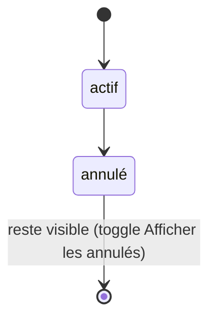
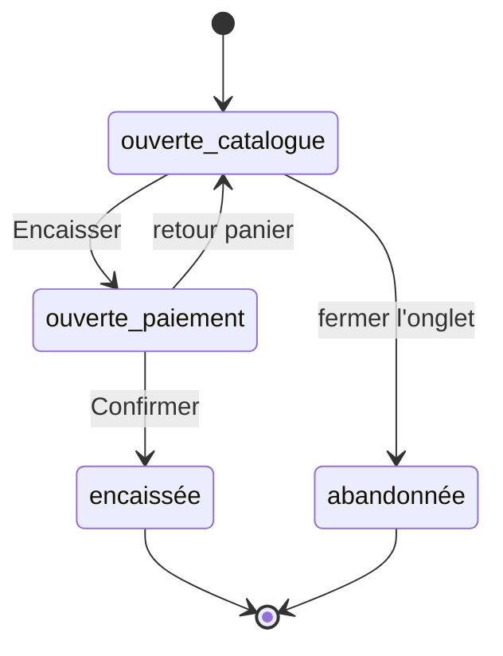

# Userflow — Point de vente (Beauty and Co) — refonte totale (v2)

> **Amendement 2026-09-01 (v2.3) — Relances entièrement automatiques ; la section devient une vue de lecture.**
> Les relances partent automatiquement ; leurs conditions, délais et textes sont définis par la
> direction dans un **back-office hors de cette app**. La réceptionniste n'envoie plus rien et ne
> configure plus rien — la section Relances est un **écran unique en lecture** : les relances déjà
> parties (cliente, type, date, canal — filtrable) et celles **à venir**, **anniversaires en tête**
> pour que le comptoir en tienne compte à l'arrivée de la cliente. **Retirés :** les trois volets
> (« La Tournée du matin » avec son geste « Valider & envoyer », « Envois groupés » et l'objet
> **Campagne**, « Contenu conseillère » avec `BeautyTip`) ; le bloc « Recommandations / Proposer »
> de la Fiche cliente ; l'autorisation de remise de reconquête. `RelanceStatus` se réduit à
> `a_venir | envoyee` et une Relance porte désormais un `channel`. Le widget « Tournée du matin »
> de l'Accueil devient **informatif** (rappel de ce qui part aujourd'hui, sans envoi). La
> **conseillère** reste la signature des messages ; son savoir est édité hors app. Voir
> `docs/adr/0010`. Les passages ci-dessous marqués v2.1 / v2.2 sur la Tournée, les Campagnes et le
> Contenu conseillère sont **supersédés**.

> **Amendement 2026-09-01 (v2.4) — Ajustement des réservations au comptoir ; équipe (ménage + horaires).**
> Deux changements, issus des notes manuscrites du 2026-09-01 (cf. `docs/adr/0009` et `CONTEXT.md`) :
> 1. **La fiche réservation redevient éditable** (§ Planning ci-dessous, ADR 0009 qui amende 0006).
>    Depuis le Planning **et** l'Accueil, la réceptionniste peut, sur une réservation qui arrive :
>    changer la prestation / la praticienne / la 2ᵉ praticienne / le·la bénéficiaire d'un
>    rendez-vous, **reprogrammer** un créneau, **ajouter** ou **retirer** un rendez-vous, **annuler**
>    avec un motif texte libre facultatif (visible dans l'historique des annulés). Seul garde-fou
>    dur : une praticienne ne peut pas tenir deux rendez-vous qui se chevauchent — bloqué. Aucune
>    **création de réservation** dans l'app : « Créer un rendez-vous » ouvre la plateforme externe.
>    `RendezVous` gagne `cancelReason?`. Nouveau terme `CONTEXT.md` : **Reprogrammer**.
> 2. **Équipe** : `Role` gagne **`menage`** ; les libellés de rôle passent au masculin (Coiffeur /
>    Esthéticien / Ménage / Accueil — la fonction, pas la personne) ; `Praticienne` gagne un horaire
>    de présence du jour (`shiftStart` / `shiftEnd`, donnée dure) affiché dans le rail Équipe du
>    Planning ; le ménage apparaît dans ce rail **sans lane** (jamais de rendez-vous).

> **Amendement 2026-09-01 (v2.5) — Relances → Messages : la section devient une messagerie.**
> La section **Relances** est renommée **Messages** (sidebar, route `/relances` → `/messages`, icône
> cœur → bulle). Elle n'est plus en lecture seule : un **fil de conversation par cliente** réunit sur
> une timeline unique les relances automatiques envoyées, celles **à venir**, et les messages
> échangés. La réceptionniste peut **prendre la main** sur un fil (elle écrit à la cliente ; les
> relances programmées de cette cliente passent **en pause**), **repasser la main à la Conseillère**,
> ou **transférer à la direction** (état terminal — la conversation quitte l'app, aucune surface
> manager créée, **ADR 0001 préservé**). Écran **maître-détail** : inbox (~380 px, tri
> attention-d'abord, **anniversaires en tête**, **signal ambre** pour un non-lu) + panneau
> conversation (en-tête + timeline de bulles + composeur, désactivé avec motif quand la Conseillère
> ou la direction tient le fil). Modèle : `Relance` (objet) disparaît au profit de **`Conversation`**
> (`{ clientId, channel, state, unread }`, `messages`) et **`Message`** (`{ sender, channel, at,
> body, relanceType?, pending? }`) ; `RelanceStatus` supprimé. **Widget « Tournée du matin » retiré
> de l'Accueil** (l'info vit dans l'inbox Messages). **Conseillère** réécrite : de « signe les
> messages » à « agent conversationnel virtuel qui tient la conversation ». Fiche cliente : le bloc
> « Relances à venir » devient un accès **« Voir les échanges »**. Voir `docs/adr/0011` (supersède
> partiellement `docs/adr/0010` : la section n'est plus lecture seule ; le principe « la
> réceptionniste ne configure pas les relances » tient). Les passages ci-dessous marqués v2.3 sur la
> lecture seule de Relances sont **supersédés**.

> **Amendement 2026-09-01 (v2.6) — Cartes cadeaux : achat externe, file de préparation.**
> Une carte cadeau est **achetée et payée sur une plateforme externe** ; à l'achat, l'acheteur choisit
> e-carte (hors périmètre), **retrait** imprimé, ou **livraison** imprimée. Les deux modes imprimés
> alimentent une **file de préparation** : la réceptionniste imprime la carte puis la remet (retrait)
> ou la confie à la livraison (hors app). **Aucun encaissement au salon** — déjà payé, ADR 0001
> préservé. Nouvel objet **`GiftCardOrder`** (« Commande de carte cadeau » : `buyerClientId`, `code`
> du ledger, `amount`, `fulfillment: retrait|livraison`, `status: a_imprimer→imprimee→remise|livree`,
> + nom/tél/adresse bénéficiaire si livraison). Le ledger `CarteCadeau` (codes/soldes, application au
> comptoir) est inchangé. **Accueil** : la cellule « Encaissé aujourd'hui » de « Le point du jour »
> devient **« Cartes à préparer »** (compteur des commandes `a_imprimer` + `imprimee`, vide en
> sourdine) → route **`/cartes-cadeaux`** (la file : acheteur + montant + badge Retrait/Livraison,
> détails livraison au dépli, actions Imprimer puis Marquer remise/expédiée). « Encaissé aujourd'hui »
> sort de l'Accueil (reste via Récap). La version « 4 dénominations à imprimer à volonté » (commit
> `7b38d71`, `components/journee/gift-cards-board.tsx`) est **abandonnée** — lecture erronée du
> concept. Voir `docs/adr/0012` (répond à la question ouverte d'émission de `docs/adr/0002`).

> **Amendement 2026-08-27 (v2.2) — Refonte 2 : Planning · Clientèle · Relances · Catalogue.** Ces
> quatre sections (et leurs sous-écrans : Équipe, Fiche cliente, Carte de fidélité, Détail planche)
> ont été **redesignées à partir des seules job stories**, dans un **nouveau langage visuel
> (« Le Tableau »)** — voir `docs/REFONTE-2.md` (inventaire exhaustif tagué + breadboards + tableau
> de couverture), `DESIGN.md` réécrit et `docs/adr/0005`. Leurs sections ci-dessous ont été
> **assainies** : plus aucune prescription de composant, de mise en page ni de style — seulement le
> parcours, les capacités par lieu et les cas limites. `Accueil`, le `Comptoir`, `/compte` et le
> `Récap des ventes` sont **hors périmètre de la Refonte 2** et gardent leur description d'origine.
> Changements structurels : Équipe fondue dans le Planning ; `Relance` promue dans le store
> (« Proposer » depuis une Fiche crée réellement une carte de tournée) ; sous-vues de la Tournée =
> réglage de vue ; sélecteurs Entreprise / Salon retirés.

> **Amendement 2026-08-27 (v2.1) — Relances promue, Clientèle recentrée, Journée → Accueil.** Après maquettage de la section Clientèle, trois changements structurels par rapport au corps du document ci-dessous, appliqués inline :
> 1. **`Journée` est renommée `Accueil`.** Le nom de refonte « Journée » est abandonné ; la section d'atterrissage redevient « Accueil ». Le verbe au comptoir reste **« Encaisser »** — « Accueillir » ne revient pas.
> 2. **`Relances` sort de Clientèle et devient un item de sidebar** (5 items : Accueil / Planning / Clientèle / Relances / Catalogue). Motif : la table de rythme ci-dessous range elle-même « la tournée de relance du matin » en **Quotidien** — elle était mal logée dans une section « pas tous les jours ». Même geste que la promotion de Planning hors de la Journée.
> 3. **`Campagnes` et `Conseils & relances` suivent Relances**, comme volets de la nouvelle section (« Envois groupés » pour les Campagnes — l'objet garde son nom, l'écran change ; « paramétrage de la conseillère » pour les conseils/délais). **`Clientèle` ne garde que `Répertoire` + `Fiche cliente`**, sur une page unique *recherche d'abord* (grande recherche + « Vues récemment » + « Attendues aujourd'hui », annuaire filtrable en dessous).
> Voir `docs/adr/0004`. `CONTEXT.md` porte les entrées Accueil / Clientèle / Relances / Campagne. Les sections « Journée » et « Clientèle » ci-dessous sont conservées mais annotées.
>
> Construit avec la technique de *breadboarding* (Shape Up / Ryan Singer) — cf. `/layers-interaction-flow`. Chaque endroit (« lieu ») est nommé de façon significative, chaque affordance porte une destination explicite, chaque état d'échec/vide/annulation est traité comme une étape à part entière.
>
> **Ceci n'est pas une révision de l'existant : c'est une réinvention complète de l'architecture d'interaction.** La v1 de ce document (conservée dans l'historique git) gardait la même carte des 6 modules que l'app actuelle et corrigeait des détails. Cette v2 repart du besoin réel (`PRODUCT.md`, `FEATURES.md`) et redessine l'organisation depuis zéro — **aucun écran de l'app actuelle ne sera réutilisé tel quel** ; les futurs écrans seront construits à partir de ce document, pas l'inverse.
>
> Le **Stock** reste totalement exclu. Toute la portée fonctionnelle listée dans `FEATURES.md` doit se retrouver quelque part ci-dessous — un tableau de couverture en fin de document le vérifie explicitement.

---

## Le changement de modèle

L'app actuelle organise tout en **6 modules à plat, par nom d'objet métier** : Accueil, Planning, Clients, Suivi, Lookbook, Paramètres — chacun un onglet de sidebar, chacun une destination qu'on quitte pour aller ailleurs. Deux symptômes concrets de ce modèle, déjà relevés dans `FEATURES.md` :

- **La Vente est une page comme une autre.** Or `PRODUCT.md` est clair : c'est le terrain quasi permanent de la caissière, interrompu à tout moment par une cliente qui se présente pendant qu'elle consultait autre chose. En faire une page qu'on « quitte » (et qui perd ses autres onglets de vente si on part vers l'Accueil) est un contresens vis-à-vis du métier réel.
- **Suivi, Campagnes et Lookbook sont trois silos qui parlent en réalité de la même chose** — la relation avec une cliente dans le temps — mais ne se répondent jamais entre eux (le Lookbook ne renvoie nulle part, une recommandation de Suivi référence un style qu'on ne peut pas consulter depuis la fiche cliente).

**Principe de la refonte : organiser par rythme d'usage, pas par nom d'objet.**

| Rythme | Ce que c'est | Devient |
|---|---|---|
| **Immédiat** (secondes, interruptible à tout moment) | Identifier une cliente, vendre, encaisser | Un **calque transversal** (« Comptoir »), pas une page — accessible et persistant depuis n'importe quel écran |
| **Quotidien — le jour** (consulté par rafales en début/creux de journée) | Qui vient aujourd'hui, l'argent du jour | **Accueil** (ex-« Journée ») — un centre de pilotage du jour, remplace l'ancien Accueil statique + le Planning *du jour* + le bandeau Suivi |
| **Quotidien — la relation pilotée** (une pile à vider chaque matin) | La tournée de relance du matin, les envois groupés, le paramétrage de la conseillère qui les alimente | **Relances** — item de sidebar propre (v2.1). Le widget « Tournée du matin » de l'Accueil en est le raccourci ; le traitement carte par carte vit ici |
| **Occasionnel** (rare pour la réceptionniste — la plupart des rendez-vous sont pris en ligne par les clientes) | Gérer l'agenda : vue semaine, dispo de l'équipe, créer / modifier / annuler un rendez-vous | **Planning** — une section à part ; la *chronologie du jour* reste sur l'Accueil, seule la *gestion* de l'agenda vit ici |
| **Relationnel** (consulté en profondeur, pas tous les jours) | Recherche d'une cliente, historique, fidélité, abonnement, préférences, recommandations | **Clientèle** — Répertoire (recherche d'abord) + Fiche cliente. La tournée de relance et les campagnes sont parties dans **Relances** (v2.1) |
| **Référence** (consulté ponctuellement par la réceptionniste ou les praticiennes) | Styles signature + photos de référence à montrer / recommander (ex-Lookbook) | **Catalogue** — un module de consultation autonome, sans lien avec l'encaissement |

La sidebar passe de **6 items à 5** (Accueil / Planning / Clientèle / Relances / Catalogue) + la **barre Comptoir**, ancrée au pied de la zone de travail sur toutes les sections, pleine largeur : ce n'est pas un item de navigation mais une capacité globale — le Comptoir replié — et c'est l'action n°1 du poste, donc une vraie barre au repos (voir § barre Comptoir), jamais une pastille dans un coin. Il n'y a **plus de section Réglages** : point-de-vente a un persona unique (ADR 0001), les seuls écrans « moi » (Profil, Sécurité) vivent sous `/compte`, atteint par le menu identité du pied de sidebar.

**Pourquoi Planning sort de l'Accueil.** Le geste quotidien de la réceptionniste, c'est *encaisser* ; consulter la chronologie du jour en est le contexte (qui va venir payer). Mais *consulter l'agenda complet* — la semaine, les disponibilités de l'équipe, l'historique des annulations — est rare : les clientes réservent elles-mêmes en ligne sur une autre plateforme et les réservations arrivent fermes. Fondre les deux dans l'Accueil chargeait l'écran d'atterrissage d'une surface d'exception. Séparer *timeline du jour* (Accueil) et *agenda complet* (Planning) applique le principe de rythme d'usage plus finement, pas moins : de la consultation rare, niveau section propre — pas du pilotage quotidien. *(À l'origine ce raisonnement portait aussi sur « créer un rendez-vous » ; ADR 0006 a depuis retiré la prise de rendez-vous de l'app.)*

**Pourquoi Relances sort de Clientèle (v2.1).** Le même raisonnement, appliqué à l'autre bout. La v2 fondait Suivi + Campagnes + Conseils dans Clientèle « parce que ce sont des façons de regarder la relation cliente dans le temps » — vrai sur le fond, mais la table de rythme ci-dessus range « la tournée de relance du matin » en **Quotidien**, pas en « Relationnel, pas tous les jours ». Enterrer un geste quotidien sous un onglet d'une section de consultation, c'était le même contresens que mettre « Nouveau rendez-vous » sur l'atterrissage. La v2 le sentait déjà : elle a dû créer le widget « Tournée du matin » sur la Journée *pour compenser*. La v2.1 assume la conséquence — Relances est une section, le widget en reste le raccourci. Clientèle redevient ce qu'elle est vraiment : chercher une cliente et lire sa fiche. Le lien de cross-référence que la fusion cherchait à préserver (une recommandation de Fiche cliente crée une carte de Relance) survit très bien entre deux sections — il n'exigeait pas la co-location dans une même barre d'onglets.

---

## Modèle conceptuel (précondition de ce flow)

*Passage formalisé avec `/layers-conceptual-model` — la v2 précédente affirmait ces unifications en une phrase chacune ; ce qui suit fixe leurs attributs, relations (cardinalité + rôle) et états, pour qu'elles soient réellement construisables plutôt que déclarées.*

### Objets

| Objet | Ce que c'est (point de vue utilisatrice) | Relations clés | États |
|---|---|---|---|
| **Cliente** | Une personne identifiée du salon, avec son historique. Porte un **pays de résidence** (`residenceCountry`, obligatoire à la création, défaut Sénégal) et sa **Préférence** — type de cheveux, référence couleur, et un texte libre + des photos par domaine (mani-pédi-onglerie / coiffure / spa / épilation / boisson) ; une note de la fiche peut être rangée dans l'un de ces domaines (v2.4). | `1,1 —— 0,1 Abonnement` · `1,1 —— 0,N Vente` (rôle : cliente de) · `1,1 —— 0,N Rendez-vous` (rôle : bénéficiaire) · `1,1 —— 1,1 Conversation` (rôle : fil) | — (pas de cycle de vie propre ; une fiche existe ou n'existe pas) |
| **Praticienne** | Un membre de l'équipe. `role` ∈ coiffeuse · esthéticienne · **ménage** · accueil (libellés affichés au masculin — la fonction, pas la personne). Porte un **horaire de présence du jour** (`shiftStart` / `shiftEnd`) affiché dans le rail Équipe. Le ménage et l'accueil ne tiennent jamais de rendez-vous ; le ménage figure quand même dans le rail Équipe, l'accueil non (v2.4). | `1,1 —— 0,N Rendez-vous` (assignée) · `1,1 —— 0,N Rendez-vous` (seconde, prestations « à 2 ») | `présente / absente aujourd'hui / repos` (dérivé, pas un cycle de vie stocké) |
| **Réservation** | La prise de rendez-vous au niveau de la **payeuse** : une cliente réserve, pour elle et éventuellement d'autres, une ou plusieurs prestations sur une ou plusieurs praticiennes. Presque toujours faite en ligne (`source`) — le parcours de réservation ne vit pas dans cette app. L'unité qu'on encaisse. | `N,1 —— 1,1 Cliente` (rôle : *payeuse*) · `1,1 —— 1,N Rendez-vous` · **`1,1 —— 0,1 Vente`** (rôle : *passage en caisse* — le lien qui déclenche le badge « En cours ») | — (pas de cycle de vie propre ; son statut effectif se déduit de ses rendez-vous) |
| **Rendez-vous** | Une **prestation planifiée** atomique : une prestation, un·e bénéficiaire, un créneau, une praticienne — deux si la prestation est « réalisable à 2 » (`secondStaffId`, durée déjà divisée). Plusieurs peuvent partager la même heure. Ligne d'une Réservation. La réceptionniste l'**ajuste** au comptoir (prestation, praticienne, bénéficiaire, **reprogrammation**, ajout / retrait, annulation avec `cancelReason?` facultatif) — jamais de création (v2.4, ADR 0009). | `N,1 —— 1,1 Réservation` · `N,1 —— 1,1 Praticienne` (assignée) · `N,1 —— 0,1 Praticienne` (seconde) · `N,1 —— 1,1 Service` · `N,1 —— 0,1 Cliente` (bénéficiaire ; sinon `beneficiaryName` libre ; sinon la payeuse) | `actif → (annulé)` — **pas** de « en attente / confirmé » (les réservations arrivent fermes de la plateforme en ligne) ; Annulé est terminal, jamais supprimé (cf. toggle « Afficher les annulés ») ; un rendez-vous *retiré* (erreur de saisie) disparaît, distinct d'*annulé* |
| **Vente** (panier) | Une transaction en cours de construction ou déjà encaissée, un onglet du Comptoir. | `1,1 —— 0,1 Cliente` · `1,1 —— 0,N LigneDePanier` · `0,1 —— 1,1 Réservation` (rôle inverse : *origine*, si ouverte via « Encaisser ») · `1,1 —— 0,1 CarteCadeau` (appliquée) · `1,1 —— 0,1 Remise` (accordée par la réceptionniste) | `ouverte(catalogue\|paiement) → encaissée` (terminal, produit un Reçu) **ou** `→ abandonnée` (fermée sans encaissement — nouvel état, nécessaire pour que le Récap des ventes distingue une vraie vente d'un onglet fermé vide) |
| **Remise** | Une réduction exprimée en montant fixe **ou** en pourcentage — `{ mode, valeur }`. Le **même objet** est porté par une Vente (remise accordée au comptoir : jusqu'à 10 % des prestations au code réceptionniste, 10–20 % avec un **code manager**, + motif) et par une relance de reconquête — un **Message** (ex. −15 %, code promo, défini par la direction). Les *points fidélité utilisés* et la *carte cadeau* ne sont **pas** des Remise — ce sont des mécanismes distincts qui, avec la Remise, se cumulent dans le calcul du total. | `0,N —— 1,1 Vente` *ou* `0,N —— 1,1 Message` (jamais les deux) | — (valeur figée à la création ; pour une Vente, le `motif` est renseigné après l'encaissement) |
| **CarteCadeau** | Un instrument **prépayé** (pas une remise) : un code, un solde propre, un statut. Achetée hors app. Une Vente n'en consomme que ce qu'il faut ; le reliquat reste sur la carte. | `0,N —— 0,1 Vente` (appliquée) · `1,1 —— 0,N GiftCardOrder` (via `code`) | `active → utilisée` (solde épuisé) · `expirée` (terminal) |
| **GiftCardOrder** (commande de carte cadeau) | Une carte cadeau achetée en version **imprimée** que le salon prépare : imprimer, puis remettre (retrait) ou confier à la livraison. Aucun encaissement (v2.6). Porte l'acheteur, le montant, le code du ledger, le mode, et — si livraison — nom/tél/adresse du bénéficiaire. | `N,1 —— 1,1 Cliente` (rôle : acheteur) · `N,1 —— 1,1 CarteCadeau` (via `code`) | `a_imprimer → imprimee → remise` (retrait) / `→ livree` (livraison — confiée au coursier, hors app) |
| **Style** | Un contenu du **Catalogue** de références (ex-Lookbook) : un rendu à montrer ou recommander. Consulté depuis le module Catalogue ou une recommandation de Fiche cliente — jamais depuis le Comptoir, aucun lien avec le panier. | `0,N —— 0,N Message` (référencé par une relance de recommandation) | — |
| **Conversation** (fil) | La messagerie avec une cliente : une timeline de **Messages** (section Messages), plus un canal et un état. Un fil par cliente. La direction pilote toujours les relances hors de l'app ; la réceptionniste **échange** sans rien configurer (v2.5). | `1,1 —— 1,1 Cliente` · `1,1 —— 1,N Message` | `auto → conseillere ⇄ receptionniste` ; `→ direction` (terminal — transféré hors app, fil figé). `receptionniste` **met en pause** les relances programmées de la cliente. |
| **Message** | Une entrée d'un **Fil** : un émetteur (cliente / réceptionniste / Conseillère), un canal, une date, un corps. Une **relance** = un Message de la Conseillère avec un `relanceType` (anniversaire / soins / fidélité / reconquête / recommandation) ; `pending` tant qu'elle n'est pas partie. Réponses cliente + Conseillère simulées (prototype). | `N,1 —— 1,1 Conversation` · `N,1 —— 0,1 Style` (relance de recommandation) · `N,1 —— 0,1 Remise` (relance de reconquête) | `pending → envoyé` pour une relance ; les autres messages n'ont pas d'état |

### Carte relationnelle

```mermaid
erDiagram
    Cliente ||--o| Abonnement : "possède"
    Cliente ||--o{ Vente : "cliente de"
    Cliente ||--o{ Reservation : "payeuse"
    Cliente ||--o{ RendezVous : "bénéficiaire"
    Cliente ||--|| Conversation : "fil"
    Reservation ||--|{ RendezVous : "regroupe"
    Reservation |o--o| Vente : "origine (Encaisser)"
    RendezVous }o--|| Praticienne : "assigné à"
    RendezVous }o--o| Praticienne : "seconde (à 2)"
    RendezVous }o--|| Service : "porte"
    Vente ||--o{ LigneDePanier : "contient"
    Vente |o--o| Remise : "accordée"
    Vente |o--o| CarteCadeau : "appliquée"
    Conversation ||--|{ Message : "timeline"
    Message |o--o| Remise : "relance reconquête"
    Message }o--o| Style : "relance recommande"
```

### États — Rendez-vous et Vente





### Ce que ça change concrètement par rapport à la v2 précédente

- **Réservation / Rendez-vous** (`docs/adr/0006`) : le `RendezVous` mono-valué (`{ clientId, staffId, serviceId, start, durationMin }`) est scindé. Une **Réservation** porte la payeuse et le lien Vente ; elle regroupe 1..N **Rendez-vous atomiques** (une prestation, un·e bénéficiaire, un créneau, une ou deux praticiennes). Encaisser agit sur la réservation → une Vente, un seul règlement pour toutes les prestations. Le badge « En cours » n'est **pas** un statut : c'est la présence d'une relation `Réservation → Vente ouverte`. La **prise de rendez-vous est retirée de l'app** (faite en ligne) ; un rendez-vous est **actif ou annulé** (pas de « en attente / confirmé ») ; ne restent que **Annuler** et **Encaisser**.
- **Service** gagne `twoPractitionersEligible` ; le Menu est régénéré verbatim depuis le catalogue de réservation b&co (107 prestations, 8 catégories).
- **Remise / CarteCadeau / Points fidélité** : le « code manager » de `FEATURES.md` (n'importe quelle chaîne → 5 000 F) et la carte cadeau à montant fixe (25 000 F) disparaissent. Trois mécanismes distincts, cumulables, pouvant amener le total à 0 F — voir § Comptoir et ADR 0002–0003.
- **Vente** gagne un état **abandonnée**, absent de la v2 précédente : sans lui, le nouveau Récap des ventes (cf. section Accueil) ne peut pas distinguer une transaction réelle d'un onglet ouvert puis refermé vide — un objet ne mérite cet état persistant que parce qu'un vrai écran (le Récap) en a besoin, pas par exhaustivité gratuite.
- **Relance** devient officiellement un seul objet à type discriminé plutôt que 3 formes de cartes qui se ressemblent sans être nommées comme la même chose — la vocabulaire list de `FEATURES.md` (« contact »/« pending »/« discount ») devient un attribut `type` de l'objet, pas trois objets distincts.
- **Relances** (v2.3) : la section est une **vue en lecture seule**. L'envoi est automatique, piloté hors de l'app ; `RelanceStatus` = `a_venir | envoyee` ; une Relance porte un `channel`. L'objet **Campagne** et le **Contenu conseillère** (`BeautyTip`) sont retirés, ainsi que « Proposer » depuis la Fiche cliente. Voir `docs/adr/0010` (supersède `docs/adr/0004` sur ces points).
- **Clientèle** (v2.1) : réduite à Répertoire + Fiche cliente, sur une page unique *recherche d'abord*. L'annuaire filtrable (Toutes / Nouvelles / Historique / VIP) reste, mais **sous** la recherche et les listes contextuelles (« Vues récemment », « Attendues aujourd'hui ») — pas une route à part.
- **Cliente** : un seul mécanisme de recherche (« Chercher une cliente »), réutilisé identiquement dans le Comptoir et le Répertoire de Clientèle.
  - [ Le jour où cette recherche interroge un vrai backend : timeout ou erreur → message inline + « Réessayer », la saisie déjà tapée reste dans le champ — même comportement partout où le mécanisme est utilisé ]
- **Style** : le catalogue de références (ex-Lookbook) devient un **module autonome** (« Catalogue »), consulté ponctuellement par la réceptionniste ou les praticiennes ; il absorbe aussi les **Photos de référence** (ex-Réglages). Points d'entrée : le module lui-même, et une recommandation de Fiche cliente. Il ne touche plus jamais l'encaissement — pas de tiroir dans le Comptoir, pas de « Ajouter au panier ».
- **Planning** : la gestion de l'agenda (grille semaine, dispo équipe, annulation / **ajustement** d'un rendez-vous) devient une **section de navigation à part**. L'Accueil n'en garde que la *chronologie du jour* (lecture + « Encaisser »). La **création de réservation reste hors de l'app** (réservations faites en ligne, `docs/adr/0006`) ; l'**édition** d'une réservation qui arrive est rouverte au comptoir (v2.4, `docs/adr/0009`).
- **« Accueillir » → « Encaisser »** : le geste depuis un rendez-vous s'appelle désormais « Encaisser ». Le modèle mental change — ce n'est pas un accueil à l'arrivée (la cliente va directement voir sa praticienne), c'est le passage en caisse **à la fin** de la prestation.

### Vocabulaire encore à confirmer

- **« Cliente » vs « client »** : ce document choisit systématiquement le féminin (cohérent avec la clientèle très majoritairement féminine du salon), alors que `CONTEXT.md` liste encore « Client » comme terme « à définir ». À fixer via `/grill-with-docs`, pas à laisser trancher implicitement par l'usage de ce document.
- *(Résolus depuis)* : « Accueillir » → **Encaisser** (le verbe) ; noms de sections → **Accueil / Planning / Clientèle / Relances / Catalogue** (« Journée » abandonné, v2.1) ; **Menu** = la liste encaissable (ex « le catalogue » du Comptoir). Voir `CONTEXT.md`.

---

## Principes directeurs

1. **Un seul poste, tactile, desktop uniquement.** Aucune variante mobile/responsive. Cibles primaires ≥ 44px, feedback de pression visible, pas d'affordance hover-only.
2. **La vente ne se quitte jamais, elle se replie.** Voir « Calque transversal — Comptoir » ci-dessous : c'est le changement le plus structurant de cette refonte.
3. **Un seul mécanisme par capacité transverse** : une seule recherche cliente, un seul patron de confirmation destructrice, un seul patron de validation de formulaire, un seul composant d'état vide — réutilisés partout plutôt que réimplémentés section par section.
4. **Aucun stub silencieux.** Une capacité pas encore prête le dit visuellement (grisée, « Bientôt disponible ») ou n'apparaît pas du tout — jamais un clic qui ne produit rien.
5. **Vocabulaire fixé par `CONTEXT.md`** : « rendez-vous » toujours en toutes lettres (jamais « RDV » hors abréviation d'affichage dans une grille étroite). Les noms des 5 sections (Accueil / Planning / Clientèle / Relances / Catalogue), « Comptoir », « Encaisser », « Menu », « Remise accordée », « Campagne » sont désormais dans `CONTEXT.md` — s'y référer.
6. **Aucun échec silencieux d'un mécanisme transverse.** Paiement, envoi de message, sauvegarde, recherche cliente : un échec réseau ou service garde toujours la saisie déjà faite, affiche une erreur explicite et propose un « Réessayer » — jamais un écran qui ne réagit pas, jamais une saisie perdue parce que l'appel derrière a échoué.
7. **Le ton rassure, jamais n'accuse.** Chaque confirmation ou erreur s'adresse à une réceptionnière non technicienne, souvent sous pression avec une cliente en face : phrases complètes et concrètes, jamais de code d'erreur ni de jargon système, toujours l'action suivante à faire clairement énoncée. Pas « Erreur : code invalide » mais « Ce code n'est pas reconnu — vérifiez-le ou continuez sans remise ». Pas un silence pendant un scan ou un enregistrement, mais un état visible (« Recherche en cours… », « Enregistrement… »).

---

## Portée de ce document

Ce document décrit **le parcours et les fonctionnalités attendues de chaque écran** — pas sa mise en œuvre visuelle. Aucun choix de composant, de mise en page ou de style n'y est figé : ces décisions se prennent au moment de construire les écrans, à partir du design system, pas ici.

Chaque section se termine par une liste **Fonctionnalités par écran** : un bloc par lieu, énumérant ce que l'écran doit faire et comment il se comporte dans les cas limites (échec, vide, annulation). C'est la checklist de construction ; les blocs breadboard au-dessus en donnent le déroulé.

---

## Carte des lieux

```mermaid
graph TB
    subgraph Transversal["Calque transversal — toujours accessible"]
        CPT[Comptoir]
    end

    A[Accueil] --> J1[Chronologie du jour]
    A --> J5[Récap des ventes]
    A --> GC[Cartes à préparer]
    GC --> GCQ[/cartes-cadeaux - file : imprimer, remettre, expédier]
    A --> CPT
    J1 --> JD[Détail rendez-vous - lecture + Encaisser]
    JD --> CPT

    P[Planning] --> P2[Grille semaine]
    P --> P3[Équipe]
    P2 --> P4[Détail / Formulaire rendez-vous]
    P4 --> CPT

    CL[Clientèle] --> CL2["Répertoire — recherche d'abord + annuaire"]
    CL2 --> CL3[Fiche cliente]
    CL2 --> CL4[Nouvelle cliente]
    CL3 --> CL5[Carte de fidélité]

    RL[Messages - inbox maître-détail] --> RL1[Inbox - anniversaires + non-lus en tête]
    RL --> RL2[Conversation - timeline + composeur]
    RL2 --> RL3[Transférer à la direction - hors app, terminal]
    CL3 -.->|Voir les échanges| RL2

    CAT[Catalogue] --> CAT2[Styles]
    CAT --> CAT3[Photos de référence]
    CAT2 --> CAT4[Détail style]
    CL3 --> CAT4

    ID[Menu identité - pied sidebar] --> CO[/compte : Profil / Sécurité]

    CPT -.->|Encaisser| JD
    CPT -.->|Chercher une cliente, partagé| CL2
```

---

## Calque transversal — Comptoir

*Ce n'est le job story de personne en particulier : c'est la capacité qui traverse tous les job stories ci-dessous. Décrite une seule fois ici.*

```
Barre Comptoir (ancrée au pied de la zone de travail, pleine largeur, visible sur TOUTE section : Accueil, Planning, Clientèle, Relances, Catalogue)
- C'est le Comptoir **replié** — l'action n°1 du poste, donc une vraie barre au repos, jamais une pastille dans un coin :
  - aucune vente ouverte → fond rose plein, « + Nouvelle vente » pleine largeur, un tap ouvre directement un onglet vide dans le Comptoir déployé
  - au moins une vente ouverte → fond taupe plein : la cliente et le total du panier actif + « Ouvrir le comptoir » ; un tap rouvre le Comptoir là où il a été laissé — ne jamais afficher « 0 vente »
  - la bascule rose → taupe est elle-même le signal qu'une vente existe maintenant
- Le Comptoir déployé peut être **replié** (et non « quitté ») → retour instantané à la section qui était affichée dessous, la barre réapparaît avec l'état à jour
  - le repli **préserve l'état interne exact** du Comptoir : onglet actif, étape (Menu/Panier/Paiement/Reçu) — repli et redéploiement ne sont jamais un reset ; redéployer rouvre exactement là où on l'a laissé, y compris en plein milieu d'un Paiement (le poste est interruptible à tout moment, le Comptoir doit l'être tout autant)

Pied de sidebar (rare)
- Bloc identité (avatar, nom, fonction de l'utilisateur au poste) → menu : « Mon compte » (`/compte`), « Changer d'utilisateur », « Déconnexion » (même patron de confirmation que partout ailleurs, plus le `window.confirm` natif actuel)
[ Naviguer entre Accueil / Planning / Clientèle / Relances / Catalogue ne ferme jamais un onglet de vente ouvert — corrige la perte des autres ventes actuelle en quittant vers l'Accueil ]
[ Fermeture accidentelle de l'onglet navigateur, ou crash, en pleine vente (tout l'état vit en mémoire React, sans backend — cf. `FEATURES.md`) → au rechargement, message explicite plutôt qu'un Comptoir vide silencieux : « Vos ventes en cours n'ont pas pu être conservées, merci de recommencer » ; un avertissement navigateur standard se déclenche déjà si on ferme l'onglet pendant qu'une vente est ouverte, mais ne protège pas d'un crash — une persistance locale minimale (stockage navigateur) reste une décision ouverte, pas un détail à négliger vu la fréquence d'un poste utilisé toute la journée ]

Comptoir (déployé)
- onglets de vente en haut (une vente = un onglet), « + » pour en ouvrir une nouvelle, fermeture d'un onglet avec panier non vide → Confirmation (le patron de dialogue unique de l'app)
- « Replier » (et non « Retour » / pas de flèche vers une page parente puisque le Comptoir n'a pas de parent — il flotte au-dessus de tout)
- Cliente : Chercher une cliente (mécanisme unique, cf. Modèle conceptuel) ou « Scanner » ou « + Nouvelle cliente »
  - ouverture via « Encaisser » depuis une réservation → panier auto-rempli avec toutes ses prestations (payeuse + « pour {bénéficiaire} » sur les lignes concernées), message explicite (« Prestations de la réservation ajoutées »)
- bascule Services / Produits, recherche, catégories, grille de tuiles → ajout au panier (incrémente si déjà présent)
- panier : stepper qty, retrait de ligne, section Remise (panneau dédié). **Trois mécanismes, cumulables, pouvant amener le total à 0 F :**
  1. **Carte cadeau** — code saisi ou scanné. Instrument prépayé : la carte a un solde ; la vente en consomme ce qu'il faut, le **reliquat reste sur la carte** et s'affiche (« couvre −18 000 F · reste 7 000 F sur la carte »). Un seul code actif à la fois — en appliquer un second **remplace** le premier avec un message inline (« remplace la carte XXX »).
     - [ Carte déjà utilisée ou expirée → message distinct d'une faute de frappe : « Cette carte a déjà été utilisée » / « Cette carte a expiré le [date] », jamais le même texte générique qu'un code non reconnu — un message qui semble accuser la cliente en face serait un mauvais moment à vivre au comptoir ]
  2. **Points fidélité** — stepper ±100 pts, borné au solde de la cliente (100 pts = 1 000 F). Masqué si la cliente a < 100 pts.
  3. **Remise accordée** — la réceptionniste saisit **son code personnel** (4 caractères), choisit **Montant** ou **Pourcentage**, puis la valeur. **Jusqu'à 10 % du total des prestations** avec son seul code ; **de 10 à 20 %**, un champ **code manager** (4–6 chiffres, non vérifié — mock) apparaît et devient obligatoire. **20 % est le plafond absolu** — au-delà, refus explicite. Services seuls, les produits n'en bénéficient jamais. Le **motif** n'est PAS demandé ici : il est saisi juste après l'encaissement (voir Paiement). Cf. ADR 0008.
  - ordre de calcul : remise accordée (sur les prestations) → points → carte cadeau en dernier, clampée à ce qui reste dû
  - le pied de ticket et le reçu **ventilent** les lignes de remise, jamais un total « Remises » agrégé
- « Encaisser » (désactivé + texte d'aide tant que panier vide ou cliente non identifiée) → Paiement

Scanner (dialogue, caméra réelle — un seul lieu, réutilisé identification cliente ET code cadeau)
- cadre de visée, erreur caméra affichée si besoin
- « Simuler la détection » (explicitement étiqueté mode démo) → pré-remplit le champ d'origine (cliente ou code cadeau), ne l'applique jamais à l'aveugle sans étape de confirmation
- [ Caméra refuse l'accès en pleine vente (scan cliente ou carte cadeau) → le panier et l'onglet en cours restent strictement intacts ; message rassurant (« Caméra indisponible — utilisez la recherche ou la saisie manuelle ») avec le champ de saisie déjà au premier plan, jamais un blocage qui force à fermer l'onglet ]
- [ Cliente scannée sans aucune correspondance → pas le texte froid « aucune correspondance » seul : CTA direct « Créer une nouvelle cliente » qui ouvre Nouvelle cliente pré-remplie du numéro lu si disponible, retour au Comptoir avec la cliente déjà sélectionnée une fois créée — le parcours de récupération est aussi direct que la recherche elle-même ]

Paiement (dans le Comptoir déployé)
- À payer affiché en évidence ; si une remise s'applique, le sous-total barré + le total des remises sont rappelés dessous
- 4 modes (Wave / Orange Money / Espèces / Carte), sélection simple ou mixte (2 modes, jamais deux fois le même)
- rendu de monnaie calculé uniquement si Espèces est impliqué ; égalité exacte exigée sur les rails 100 % digitaux
- [ Répartition mixte qui ne tombe jamais juste (erreur de saisie) → « Confirmer » reste désactivé, l'écart restant s'affiche en direct (« reste 500 F à répartir »), un bouton « Recommencer la répartition » remet les deux montants à zéro sans perdre les 2 modes choisis ni renvoyer au panier — se tromper ne doit jamais coûter de tout reprendre depuis le Menu ]
- « Confirmer l'encaissement » → (si une remise accordée est en jeu) **Motif de remise** → Reçu
- **Motif de remise** : écran bloquant, **après** « Confirmer » et **avant** le reçu, uniquement si une remise accordée a été appliquée. Texte libre obligatoire (≥ 3 caractères). Jamais demandé avant l'encaissement — ne pas ralentir le comptoir avec une cliente en face ; la justification se pose une fois l'argent pris. Apparaît ensuite sur le reçu et dans le Récap des ventes.

Reçu (dans le Comptoir déployé)
- récap complet : lignes de prestations, **sous-total, puis chaque remise ventilée** (remise accordée X % + motif · points fidélité N pts · carte cadeau « CODE » + reliquat), total, détail du/des paiements
- points fidélité réellement écrits dans le profil cliente (gagnés sur le total après remises)
- « Imprimer le reçu »
  - [ Impression impossible (imprimante hors ligne/absente) → le reçu reste affiché à l'écran, un bouton « Réessayer l'impression » remplace l'échec silencieux, et « Nouvelle vente »/« Replier » restent utilisables sans dépendre de l'impression — la vente est déjà encaissée, un souci d'imprimante ne doit jamais donner l'impression que la vente elle-même a échoué ]
- « Revenir à l'Accueil » → ferme cet onglet, revient à l'Accueil
- « Nouvelle vente » → ferme cet onglet, garde les autres ouverts
- « Replier » → retour à la section qui était affichée avant d'ouvrir le Comptoir, barre Comptoir remise à jour
```

**Ce que ce calque résout structurellement** : plus de « page Vente » qu'on quitte et qui perd son état ; un seul endroit pour scanner un code (client ou cadeau).

**Assignation praticienne retirée du panier** : le panier ne porte plus d'assignation par ligne. La praticienne d'une vente est celle du rendez-vous d'origine (via « Encaisser ») ou aucune pour une vente au comptoir ; le Récap des ventes ventile sur cette base.

**Décisions actées** : le rendu de monnaie sur les paiements impliquant Espèces est une **capacité nouvelle** ; l'auto-remplissage du panier depuis un rendez-vous est explicite (message dans le panier) ; le scan ne s'applique plus jamais sans étape de confirmation, y compris la carte cadeau ; la carte cadeau devient un instrument prépayé (reliquat conservé, cf. ADR 0002) ; la « remise manager » devient une remise réceptionniste bornée à 10 % au code personnel, 20 % avec un code manager ponctuel, motif obligatoire (cf. ADR 0003, 0008) ; un reçu imprimable existe enfin.

### Fonctionnalités par écran

#### Barre Comptoir (pied de la zone de travail, pleine largeur, visible sur les 4 sections)
- Aucune vente ouverte → barre rose, bouton « + Nouvelle vente » pleine largeur → ouvre directement un onglet vide dans le Comptoir déployé
- Au moins une vente ouverte → barre taupe : cliente + total du panier actif + « Ouvrir le comptoir » → rouvre le Comptoir là où il a été laissé ; jamais « 0 vente »
- Masquée tant que le Comptoir est déployé (le panneau plein écran la recouvre et porte « Replier »)
- Menu identité (avatar + nom, au pied de la sidebar — pas dans la barre) : « Mon compte » → `/compte` · « Changer d'utilisateur » · « Déconnexion » → confirmation (patron unique de l'app, plus de `window.confirm`)
- La barre du haut ne porte plus que la date + une horloge — le poste travaille à la minute (rendez-vous, rendu de monnaie)

#### Comptoir déployé
- Onglets de vente en haut : une vente = un onglet ; « + » ouvre une vente vide (pas de limite) ; fermer un onglet au panier non vide → confirmation
- « Replier » (jamais « Fermer », pas de croix) → retour instantané à la section affichée dessous, barre Comptoir remise à jour
- Le repli préserve l'état interne exact : onglet actif, étape (Catalogue / Panier / Paiement / Reçu) — redéployer rouvre exactement au même endroit, y compris en plein paiement
- Naviguer entre Accueil / Planning / Clientèle / Relances / Catalogue ne ferme jamais un onglet de vente
- Identification de la cliente : « Chercher une cliente » (mécanisme unique, partagé avec Répertoire et Formulaire rendez-vous), « Scanner », ou « + Nouvelle cliente »
- Ouverture via « Encaisser » depuis une réservation → panier auto-rempli avec toutes ses prestations, message explicite dans le panier (« Prestations de la réservation ajoutées »)
- Bascule Services / Produits du Menu, recherche, catégories et sous-catégories, grille de prestations → ajout au panier (incrémente la quantité si la ligne existe déjà)
- Panier : quantité par ligne, retrait de ligne (pas d'assignation de praticienne — retirée)
- Remise : panneau dédié, trois mécanismes cumulables (carte cadeau saisie/scan, points fidélité, remise accordée : ≤ 10 % des prestations au code réceptionniste, ≤ 20 % avec un code manager), erreur inline explicite ; lignes ventilées au pied de ticket
  - carte cadeau : instrument prépayé, un seul code actif à la fois, un second remplace le premier (« remplace la carte XXX ») ; déjà utilisée ou expirée → message distinct d'un code non reconnu ; reliquat affiché
  - remise accordée : code manager requis de 10 à 20 % des prestations, refus explicite au-delà de 20 % ; motif demandé après l'encaissement, jamais avant
- « Encaisser » : désactivé tant que le panier est vide ou qu'aucune cliente n'est identifiée, avec un texte d'aide visible en permanence expliquant pourquoi → passe au Paiement

#### Scanner (caméra réelle, réutilisé pour l'identification cliente ET le code cadeau)
- Cadre de visée ; message d'erreur affiché si la caméra est refusée
- « Simuler la détection » (étiqueté mode démo) → pré-remplit le champ concerné (cliente ou code cadeau), sans jamais l'appliquer sans étape de confirmation
- Caméra refusée en pleine vente → panier et onglet intacts, message rassurant (« Caméra indisponible — utilisez la recherche ou la saisie manuelle »), champ de saisie déjà au premier plan
- Cliente scannée sans correspondance → CTA direct « Créer une nouvelle cliente » (pré-remplie du numéro lu si disponible), retour au Comptoir avec la cliente sélectionnée une fois créée

#### Paiement
- Total à payer affiché en évidence ; sous-total barré + total des remises rappelés si une remise s'applique
- 4 modes : Wave / Orange Money / Espèces / Carte — sélection simple ou mixte (2 modes, jamais deux fois le même)
- Rendu de monnaie calculé uniquement si Espèces est impliqué ; égalité exacte exigée sur les rails 100 % digitaux
- Retour au panier possible sans perte d'état
- Répartition mixte incorrecte → « Confirmer » reste désactivé, l'écart restant s'affiche en direct (« reste 500 F à répartir »), « Recommencer la répartition » remet les deux montants à zéro sans perdre les modes choisis ni revenir au panier
- « Confirmer l'encaissement » → **Motif de remise** (si une remise accordée est en jeu) → Reçu

#### Motif de remise (uniquement si une remise accordée a été appliquée)
- Écran bloquant intercalé entre « Confirmer » et le Reçu — jamais avant l'encaissement
- Rappel de la remise (X % ou montant · −Y F · code réceptionniste · code manager si > 10 %) + champ texte libre obligatoire (≥ 3 caractères)
- « Enregistrer le motif » → Reçu. Le motif apparaît sur le reçu et dans le détail de la vente au Récap des ventes

#### Reçu
- Récapitulatif complet (salon, facture, cliente, lignes, sous-total / remises / total, détail du ou des paiements)
- Section Fidélité : points gagnés + solde projeté, réellement écrits dans le profil de la cliente
- « Imprimer le reçu »
  - impression impossible → le reçu reste affiché, « Réessayer l'impression » remplace l'échec silencieux, « Nouvelle vente » / « Replier » restent utilisables (la vente est déjà encaissée)
- « Revenir à l'Accueil » → ferme cet onglet, revient à l'Accueil
- « Nouvelle vente » → ferme cet onglet, garde les autres ouverts
- « Replier » → retour à la section affichée avant l'ouverture du Comptoir

---

## Section Accueil

*Écran d'atterrissage par défaut de l'app. Remplace l'ancien Accueil (dashboard statique) et absorbe la chronologie du jour + le bandeau Suivi. La consultation de l'agenda complet (vue semaine, équipe, annulation, historique des annulations) est passée dans sa propre section — voir « Section Planning ».*

```
Accueil
- Chronologie du jour : rendez-vous du jour groupés par praticien·ne (vue condensée, pas le tableau complet du Planning)
  - chaque rendez-vous → « Encaisser » → Comptoir déployé, nouvel onglet pré-rempli avec la cliente + ses prestations — LE point d'entrée d'une vente liée à un rendez-vous : la cliente a réservé en ligne, est venue, a eu sa prestation, elle passe à la caisse à la fin
  - un rendez-vous déjà pris en charge (un onglet de vente lui est déjà associé) affiche un badge « En cours » à la place du bouton « Encaisser » ; le retaper **bascule** sur l'onglet existant au lieu d'en ouvrir un doublon — répond au cas d'un double-tap ou de deux membres de l'équipe qui cliquent chacun de leur côté sur le **même** rendez-vous ; deux rendez-vous **différents** ne posent aucun conflit, chacun ouvrant son propre onglet
  - tap sur un rendez-vous → Fiche réservation (payeuse + toutes ses prestations, « Encaisser la réservation » + « Annuler cette prestation ») ; pas d'édition ni de confirmation — la prise de rendez-vous se fait en ligne
- ~~Widget « Tournée du matin »~~ **retiré (v2.5, ADR 0011)** : plus de rappel des relances sur l'Accueil ; l'info (anniversaires du jour en tête) vit dans l'inbox **Messages**
- Board « Le point du jour » — 2 cellules (v2.6) :
  - **« Cartes à préparer »** : compteur des commandes de carte cadeau non résolues (`a_imprimer` + `imprimee`) ; vide → « Aucune carte à préparer » en sourdine. → route **`/cartes-cadeaux`**
  - **« Rendez-vous du jour »** : nombre de rendez-vous du jour → section Planning
  - *(« Encaissé aujourd'hui » a quitté l'Accueil en v2.6 — reste atteignable via le Récap des ventes)*
- ~~« Cartes cadeaux à imprimer »~~ (pastilles de dénominations, `7b38d71`) **abandonné (v2.6, ADR 0012)** : remplacé par la file `/cartes-cadeaux`
- « Ouvrir le planning » → section Planning (semaine, équipe, lecture des rendez-vous)
[ Aucun rendez-vous aujourd'hui → état vide avec un lien « Ouvrir le planning » (pas de bouton de création — la prise de rendez-vous se fait en ligne, `docs/adr/0006`) ]
[ Minuit passé avec une vente encore ouverte dans le Comptoir → la vente reste rattachée à l'Accueil du jour où elle a été ouverte, jamais une bascule silencieuse vers le lendemain ; le Résumé du jour se fige à minuit et un nouvel Accueil démarre à zéro, la vente à cheval vient s'ajouter au total du jour d'origine une fois encaissée — frontière claire, pas un cas laissé au hasard de l'implémentation ]

Récap des ventes  (sous l'Accueil — l'argent du jour, pas l'agenda)
- période : Aujourd'hui / Cette semaine / Ce mois / période personnalisée
- total encaissé, nombre de ventes, panier moyen ; répartition par mode de paiement ; répartition par praticienne (déduite de la réservation d'origine, répartie au prorata du prix de chaque prestation ; « Sans rendez-vous » sinon)
- liste des ventes de la période (heure, cliente, **remise** si applicable, total, mode de paiement) → clic ouvre le Reçu correspondant en lecture seule (même écran qu'à l'encaissement) — le reçu porte la ventilation des remises et le motif d'une remise accordée
- ventes *abandonnées* de la période comptées à part, jamais mélangées au chiffre encaissé
[ Aucune vente sur la période → état vide, pas un tableau à zéro sur toutes les lignes ]
```

**Décisions actées (Accueil)** : « Encaisser » depuis la Chronologie est LE chemin d'une vente liée à une réservation ; le résumé du jour reflète des données réelles ; la prise de rendez-vous ne vit pas dans l'app (`docs/adr/0006`).

### Cartes cadeaux à préparer — route `/cartes-cadeaux` (v2.6)

*La file des cartes cadeaux achetées en version imprimée, à préparer par la réceptionniste. Achat + paiement hors app. Atteinte par la cellule « Cartes à préparer » de l'Accueil.*

```
Cartes cadeaux à préparer  (route dédiée, retour → Accueil)
- la file : toutes les commandes non résolues (a_imprimer + imprimee), sans date d'échéance, jusqu'à remise/livraison
- une ligne : acheteur (fiche cliente) · montant · badge Retrait / Livraison · statut (À imprimer / Imprimée)
  - Livraison : nom + téléphone + adresse du bénéficiaire, accessibles (dépli ou inline)
- actions par ligne :
  - statut À imprimer → « Imprimer » : impression directe de la face carte (react-to-print, PAS de dialog de preview) → passe Imprimée
  - statut Imprimée → « Marquer comme remise » (retrait) / « Marquer comme expédiée » (livraison) → quitte la file
    + « Réimprimer » (secondaire, au cas où)
- la face imprimée = code + montant + QR démo + branding (livrable client ; jamais rendue dans l'UI de la file)
[ aucune commande non résolue → « Aucune carte à préparer » ; la cellule Accueil est en sourdine ]
```

**Décisions actées (Cartes cadeaux)** : achat externe, salon = préparation, **zéro encaissement** (ADR 0001) ; `GiftCardOrder` (`buyerClientId` toujours une fiche, `code` du ledger, `fulfillment`, `status`) distinct du ledger `CarteCadeau` ; livraison réelle hors app ; face imprimée riche. Cf. `docs/adr/0012`.

---

## Section Planning

*La gestion de l'agenda. Rare pour la réceptionniste — les rendez-vous sont pris en ligne par les clientes elles-mêmes et arrivent fermes ; ici on annule une exception, on signale une absence, on encaisse, et on regarde la semaine et les disponibilités de l'équipe. La sous-page **Équipe** y est fondue (voir `docs/adr/0005`).*

> **Assaini (v2.2).** Le parcours détaillé et le raisonnement vivent dans `docs/REFONTE-2.md` §2.1. Ci-dessous : le parcours, les capacités par lieu et les cas limites — **aucune prescription de composant, de mise en page ni de style**.

```
Planning  (un seul lieu ; le roster de l'équipe y est intégré)
- « Aujourd'hui » (seulement si on a navigué ailleurs) → revient au jour réel
- naviguer d'un jour / d'une semaine à l'autre
- « Afficher les annulés » : les rendez-vous annulés restent visibles, atténués — l'historique des annulations vit ici, pas dans un écran à part
- regrouper les rendez-vous par praticienne ou pour toute l'équipe (mêmes données)
- l'équipe (rail intégré) : chaque personne porte son **horaire de présence du jour** (`shiftStart`–`shiftEnd`) et son état (présente / absente aujourd'hui / repos) ; le **ménage** y figure sans lane (jamais de rendez-vous) ; l'accueil non. Par praticienne :
  - « Voir seule » → ne garder que ses rendez-vous ; annulable
  - « Marquer absente aujourd'hui » (absence de dernière minute) → ses rendez-vous du jour sont signalés « absente » partout (ici + Chronologie de l'Accueil) ; « Encaisser » l'un d'eux impose d'indiquer la remplaçante avant d'ouvrir le Comptoir — jamais une vente attribuée à quelqu'un qui n'était pas là
- plusieurs rendez-vous à la même heure = normal (praticiennes différentes) ; un rendez-vous « à 2 » apparaît sur les deux lanes
- choisir un rendez-vous existant → Fiche réservation
- **pas de création de réservation** — la prise de rendez-vous se fait en ligne (`docs/adr/0006`) ; l'**ajustement** d'une réservation qui arrive, lui, se fait au comptoir (v2.4, `docs/adr/0009`)
[ jour affiché sans rendez-vous (le mock ne couvre qu'aujourd'hui) → le dire franchement, pas un vide muet ]
[ personne au planning ce jour-là → le dire + accès à l'équipe ]

Fiche réservation  (le détail — depuis le Planning OU la Chronologie de l'Accueil)
- en-tête : **payeuse** (la cliente qui règle) + « En cours » si une vente est ouverte (sinon rien) + « réservée en ligne / notée au comptoir » + « règle N prestations »
- corps : une ligne par prestation planifiée — prestation + prix, horaire, praticienne·s (« à 2 » le cas échéant), « pour {bénéficiaire} » si ce n'est pas la payeuse ; total des prestations
- « Encaisser la réservation » → Comptoir, onglet pré-rempli (payeuse + toutes les prestations) ; vente déjà ouverte → rebascule sur l'onglet existant
- « Ajuster la réservation » (v2.4) → éditeur : par rendez-vous, changer prestation / praticienne / 2ᵉ praticienne / bénéficiaire, **reprogrammer** le créneau ; **ajouter** ou **retirer** un rendez-vous à la réservation ; **annuler** un rendez-vous avec un **motif texte libre facultatif**. Garde-fou dur : chevauchement de deux rendez-vous d'une même praticienne → **bloqué**, message explicite. « Créer un rendez-vous » ouvre la **plateforme externe** dans un onglet — aucune création dans l'app.
- « Annuler cette prestation » → Confirmation (motif facultatif) ; statut Annulé, jamais de suppression dure. Pas de « Confirmer » : un rendez-vous arrive ferme.
[ « Annuler » alors qu'une vente est ouverte pour cette réservation → la Confirmation le signale ; l'annulation ne ferme pas l'onglet ]
[ reprogrammation / réassignation qui chevaucherait un autre rendez-vous de la praticienne → refus net, le créneau d'origine est conservé ]

Choix de la remplaçante  (bloquant — « Encaisser » quand au moins un rendez-vous de la réservation a une praticienne absente)
- pour **chaque** rendez-vous concerné : indiquer qui a réalisé la prestation (praticiennes présentes du même rôle) → le Comptoir s'ouvre, chaque prestation est réattribuée
- aucune candidate pour une ligne → le dire, sans ouvrir le Comptoir
```

**Décisions actées (Planning)** : la gestion de l'agenda est une section propre, Équipe y est fondue (`docs/adr/0005`) ; **la création de réservation reste hors de l'app** (faite en ligne, `docs/adr/0006`) mais l'**ajustement** d'une réservation qui arrive se fait au comptoir — reprogrammer, réassigner, ajouter / retirer, annuler avec motif ; seul blocage dur : chevauchement praticienne (v2.4, `docs/adr/0009`) ; un rendez-vous est actif ou annulé (pas de « en attente / confirmé ») ; « Encaisser » agit au niveau **réservation** (toutes les prestations, un seul règlement) ; annuler conserve un statut Annulé ; l'absence de dernière minute d'une praticienne a un geste dédié ; le rail Équipe porte les horaires de présence et le ménage (sans lane).

### Rappel — Fonctionnalités Accueil / Récap des ventes (hors périmètre Refonte 2)

#### Accueil (atterrissage)
- Écran d'atterrissage par défaut de l'app
- Chronologie du jour : rendez-vous du jour groupés par praticienne, vue condensée (pas le tableau complet du Planning)
  - chaque rendez-vous → « Encaisser » → Comptoir déployé, nouvel onglet pré-rempli (cliente + prestations)
  - rendez-vous déjà pris en charge → badge « En cours » à la place de « Encaisser » ; le retaper bascule sur l'onglet existant au lieu d'ouvrir un doublon
  - tap sur un rendez-vous → Fiche réservation (Encaisser · Ajuster la réservation · Annuler cette prestation avec motif ; v2.4) — identique depuis le Planning
- ~~Widget « Tournée du matin »~~ retiré (v2.5) ; « Le point du jour » : cellules « Cartes à préparer » (→ `/cartes-cadeaux`) + « Rendez-vous du jour » (v2.6, ADR 0012)
- Résumé du jour : total réellement encaissé aujourd'hui (ventes à l'état *encaissée*), nombre de rendez-vous du jour
  - « Voir le récap complet » → Récap des ventes
- « Ouvrir le planning » → section Planning
- Aucun rendez-vous aujourd'hui → état vide avec un lien « Ouvrir le planning » (pas de bouton de création)
- Minuit passé avec une vente encore ouverte → la vente reste rattachée à l'Accueil du jour d'origine ; le Résumé se fige à minuit, un nouvel Accueil démarre à zéro, la vente à cheval s'ajoute au total du jour d'origine une fois encaissée

#### Récap des ventes (sous l'Accueil)
- Période : Aujourd'hui / Cette semaine / Ce mois / période personnalisée
- Total encaissé, nombre de ventes, panier moyen ; répartition par mode de paiement ; répartition par praticienne (déduite du rendez-vous d'origine ; « Sans rendez-vous » sinon)
- Liste des ventes de la période (heure, cliente, remise si applicable, total, mode) → clic ouvre le Reçu en lecture seule (ventilation des remises + motif d'une remise accordée)
- Ventes *abandonnées* comptées à part, jamais mélangées au chiffre encaissé
- Aucune vente sur la période → état vide

### Fonctionnalités par écran — Section Planning

> Assaini (v2.2) : l'inventaire exhaustif des fonctionnalités du Planning (et de la sous-page Équipe qui y est fondue) vit dans `docs/REFONTE-2.md` §1.1–1.2, avec les tags [OK]/[SIM]/[STUB] ; le tableau de couverture §3 vérifie que rien n'est perdu. Le parcours cible est le breadboard ci-dessus.

---

## Section Clientèle

*v2.1 : la v2 fusionnait Clients + Suivi + Campagnes + Conseils & cycles de relance en onglets d'une même section. La tournée de relance étant un geste **quotidien** (cf. table de rythme + « Pourquoi Relances sort de Clientèle »), Suivi / Campagnes / Conseils sont partis dans la **section Relances**. Clientèle se recentre sur ce qui reste : **chercher une cliente, lire et tenir sa fiche**. Les Styles et les Photos de référence sont dans le module Catalogue.*

> **Assaini (v2.2).** Parcours détaillé et raisonnement dans `docs/REFONTE-2.md` §2.2 ; inventaire tagué §1.3–1.5. Ci-dessous : parcours, capacités par lieu, cas limites — **aucune prescription de composant, de mise en page ni de style**. La Fiche cliente « en-tête collant + corps deux colonnes » de la v2.1 n'est plus imposée : le design est libre (voir `DESIGN.md`).

```
Clientèle  (recherche d'abord)

Le Répertoire
- « Chercher une cliente » (mécanisme unique, partagé avec le Comptoir) : nom ou téléphone
- recherche vide → deux listes contextuelles courtes : « Vues récemment » (dernières fiches ouvertes sur le poste) et « Attendues aujourd'hui » (clientes ayant un rendez-vous ce jour) → accès direct à la fiche
- l'annuaire complet, filtrable (Toutes / Nouvelles / Historique / VIP), sur la même route
- « + Nouvelle cliente » → Nouvelle cliente
- choisir une cliente → La Fiche
[ recherche sans résultat → « Créer "…" comme nouvelle cliente » (pré-remplie de la saisie) ]
[ annuaire filtré sans résultat → « Réinitialiser les filtres » ]

La Fiche  (le tableau d'une cliente)
- identité toujours visible (nom, tier fidélité, marqueurs) + « Nouvelle vente » (→ Comptoir, cliente sélectionnée) · « Contacter » (désactivé + explication si aucune coordonnée)
- valeur & visites · **« Voir les échanges »** → le fil de la cliente dans **Messages** (aperçu des derniers messages ; v2.5) · notes internes (un point d'entrée, persistant)
- carte de fidélité (QR motif démo + impression), coordonnées (« Modifier », édition inline), préférences beauté (« Modifier »), abonnement (section toujours présente, état vide honnête) · praticienne préférée → Planning filtré
- (v2.3) le bloc « Recommandations / Proposer » est retiré — la Fiche ne crée plus de relance ; les relances partent automatiquement (`docs/adr/0010`)
[ id cliente inconnu → tableau d'erreur explicite + retour au Répertoire (jamais la fiche du 1ᵉʳ mock) ]

Nouvelle cliente  (formulaire — depuis le Répertoire OU depuis le Comptoir)
- Identité (Prénom*, Nom*, Téléphone*, WhatsApp, Email, Adresse, Profession, Anniversaire — vrai sélecteur de date) + Profil beauté
- doublon sur le téléphone → avertissement inline + « Voir la fiche existante » ; « Créer quand même » reste possible (foyer, famille) — la détection prévient, ne bloque jamais
- « Créer » → persiste → La Fiche ; ouvert depuis le Comptoir → retour au Comptoir, cliente déjà sélectionnée

Carte de fidélité  (depuis « Ouvrir » sur La Fiche)
- envoi WhatsApp / email (désactivés + explication si coordonnée absente), « Télécharger » génère réellement un fichier, « Imprimer » dédié à la carte
```

**Décisions actées (Clientèle)** : *recherche d'abord* (recherche + « Vues récemment » + « Attendues aujourd'hui », annuaire filtrable sur la même route) ; la Fiche affiche les relances **à venir** de la cliente en lecture seule (v2.3 — plus de « Proposer », cf. `docs/adr/0010`) ; la forme de la Fiche est libre (`docs/adr/0005`).

### Fonctionnalités par écran

> Assaini (v2.2) : inventaire exhaustif tagué dans `docs/REFONTE-2.md` §1.3–1.5, couverture §3. Parcours cible : le breadboard ci-dessus.

---

## Section Messages

*v2.5 : ex-**Relances**. Item de sidebar renommé (**Messages**, icône bulle), route `/messages`. Position sidebar : Accueil · Planning · Clientèle · **Messages** · Catalogue. Plus une **vue de lecture** : une messagerie. La direction pilote toujours les relances (conditions, délais, textes) hors de l'app ; la réceptionniste ne configure rien, mais elle **échange** avec la cliente. Cf. `docs/adr/0011` (supersède partiellement `0010`).*

*Job stories : (1) voir dans un fil unique ce qui a été / va être envoyé à une cliente ; (2) quand elle répond, lui répondre — ou laisser la Conseillère le faire, ou passer à la direction.*

```
Messages  (maître-détail — inbox à gauche ~380px, conversation à droite)

INBOX
Groupe épinglé « Programmées / à venir » : les relances pas encore parties, ANNIVERSAIRES EN TÊTE
  puis le reste des fils, triés : non-lus d'abord, puis activité récente
Une ligne de fil : avatar · nom · dernier message tronqué (1 ligne, sourd) · horodatage
  · glyphe de canal COLORÉ par canal (WhatsApp / SMS / email) · jeton d'état (Auto · Vous · Conseillère · Direction)
  · point ambre si réponse cliente non lue
Champ « Filtrer par cliente » (pas de bordure pointillée)
[ aucun fil → « Aucun échange » ] [ aucune programmée → le groupe épinglé disparaît ]

CONVERSATION
En-tête : nom · badge palier · canal · jeton d'état · actions de main (selon l'état) :
  - état conseillere/auto : « Répondre / Prendre la conversation »
  - état receptionniste : « Repasser à la Conseillère » · « Transférer à la direction »
  - état direction : aucune action (fil figé, lecture seule)
Timeline (haut → bas, chronologique) :
  - bulle cliente à gauche, bulle salon (réceptionniste / Conseillère) à droite ; la Conseillère signée
  - une relance ENVOYÉE = carte système : « Relance anniversaire · envoyée jeu. 3 sept · WhatsApp » + corps, signée Conseillère
  - une relance À VENIR = élément futur en bas de fil : « Anniversaire — partira le 3 sept, sauf prise en main »
    (en pause visible si l'état est receptionniste)
Composeur en bas : actif si état = receptionniste ; sinon désactivé + motif
  (« La Conseillère tient cette conversation. Prenez la main pour écrire. » / « Transférée à la direction. »)
[ fil sans aucune réponse cliente → la timeline ne montre que les relances auto ]

DIALOG « Transférer à la direction »
Confirmation qui explique que la conversation QUITTE l'app : la réceptionniste ne verra plus la suite,
la direction prend le relais hors de l'app. Irréversible depuis l'app.
```

**Décisions actées (Messages)** : `Relance` (objet) → **`Conversation`** (`{ clientId, channel, state: auto|conseillere|receptionniste|direction, unread }`, `messages`) + **`Message`** (`{ sender: cliente|receptionniste|conseillere, channel, at, body, relanceType?, pending?, lateDays?, styleId?, discountLabel? }`) ; `RelanceStatus` supprimé ; `RelanceType` / `RelanceChannel` conservés. Prise en main **met en pause** les relances programmées de la cliente. « Transférer à la direction » = **hors app**, aucune surface manager (ADR 0001). Réponses cliente + Conseillère **simulées**. Widget « Tournée du matin » retiré de l'Accueil. Cf. `docs/adr/0011`.

### Fonctionnalités par écran

> Assaini (v2.2) : inventaire exhaustif tagué dans `docs/REFONTE-2.md` §1.6, couverture §3. Parcours cible : le breadboard ci-dessus.

---

## Section Catalogue

*Le matériel de consultation (ex-Lookbook + Photos de référence). Ce n'est pas la relation avec une cliente ni de la configuration — on le parcourt ponctuellement pour montrer ou recommander un rendu. Module autonome, aucun lien avec l'encaissement.*

> **Assaini (v2.2).** Parcours détaillé dans `docs/REFONTE-2.md` §2.4 ; inventaire tagué §1.7. Ci-dessous : parcours, capacités, cas limites — **aucune prescription de composant, de mise en page ni de style**.

```
Catalogue  (2 volets : Les Planches · Photos de référence — jamais de lien vers l'encaissement)

Les Planches  (styles signature)
- filtre par catégorie ; une planche = visuel + nom + prix + marqueur tendance
- choisir une planche → Détail planche
[ catégorie sans planche → « Choisissez une autre catégorie » ]

Détail planche  (dialogue — depuis Les Planches OU une recommandation en Fiche cliente)
- visuel, nom, prix, tendance, « Fermer » — aucune action vers le panier

Photos de référence  (rare)
- filtre par catégorie ; par emplacement : ajouter / retirer un fichier
- [ fichier trop lourd / mauvais format → message inline immédiat avec la limite, jamais un emplacement bloqué en chargement ]
```

**Décisions actées (Catalogue)** : le Lookbook devient **Catalogue**, absorbe les Photos de référence ; consultation à part entière, jamais un tiroir du Comptoir ; le Détail est en lecture seule ; le sélecteur Entreprise (1 seule entreprise) est retiré.

### Fonctionnalités par écran

> Assaini (v2.2) : inventaire exhaustif tagué dans `docs/REFONTE-2.md` §1.7, couverture §3. Parcours cible : le breadboard ci-dessus.

---

## Section Réglages — supprimée

*Point-de-vente a un persona unique (ADR 0001) : il n'y a pas de rôle « direction / admin », donc pas d'écran de configuration du salon. La section Réglages disparaît entièrement.*

- **Retiré de l'app** : gestion du Menu (prestations / produits / prix / catégories — le Menu reste une donnée en lecture seule, éditée hors de l'app), Entreprises & Salons, Gestion Utilisateurs, Gestion Salon, Tendances soins, Notifications, Apparence.
- **Déplacé** : Photos de référence → **Catalogue** ; Conseils & cycles de relance → **Relances → Contenu conseillère** (v2.1 ; la v2 le plaçait dans Clientèle).
- **Devient `/compte`** : les seuls écrans « moi » — Profil, Sécurité — atteints par le menu identité du pied de sidebar.

```
/compte  (2 onglets : Profil · Sécurité)

Profil
- fiche de l'utilisateur au poste : nom, fonction, code personnel (lecture seule)
- « Changer d'utilisateur » → dialogue : choix dans la liste + PIN 4 chiffres (simulé, erreur inline si code faux)

Sécurité
- changer mon code PIN : actuel → nouveau → confirmer (4 chiffres, simulé en session, toast succès)
```

**Décisions actées** : la question ouverte « Rôles et permissions (caissière vs propriétaire / admin) » est **résolue** — un seul rôle (ADR 0001). Session simulée (`lib/session.ts`, `lib/data/utilisateurs.ts`), aucun vrai login, pas de gate au démarrage ; l'app ouvre sur l'Accueil.

<details>
<summary>Ancienne section Réglages (caduque — conservée pour trace)</summary>

## ~~Section Réglages~~

*Même esprit que l'existant (rare, configuration), mais le hub « grille de 14 cartes dont 9 mortes » disparaît au profit d'une barre d'onglets ne contenant que des capacités réelles.*

```
Réglages  (onglets : Services · Produits · Contenu conseillère · Entreprises & Salons)

Services / Produits (structure désormais identique dans les deux)
- recherche, filtre catégorie, un seul toggle « afficher les inactifs » (plus de contrôle dupliqué)
- « + Ajouter » / crayon → Formulaire (titre reflète toujours création vs édition, validation inline systématique sur les champs requis)
- dans le Formulaire, un seul toggle « actif / inactif » pour l'article lui-même (Switch **ou** bouton, jamais les deux faisant la même chose — l'anomalie touchait Produits ET Services)
- Service : changer la catégorie **préserve** le Groupe affiché personnalisé au lieu de l'écraser silencieusement — si la personne veut le réinitialiser, un bouton « Réinitialiser au groupe par défaut » explicite le fait plutôt qu'un effet de bord automatique
- Produits : vrai sélecteur de fichier pour la photo, un seul toggle « acheté à l'étranger », sélecteur Entreprise réellement branché (masqué si une seule entreprise), sélecteur Dépôt retiré (lié au Stock)
  - [ Photo produit trop lourde ou mauvais format → même message inline explicite que Photos de référence (limite en Mo affichée avant l'envoi) — un seul comportement de rejet de fichier dans toute l'app, pas deux ]
- « Catégories » → gestion réelle (ajout/renommage) dans les deux modules, comptage live

Contenu conseillère  (fusionne Photos de référence + Conseils beauté — les deux nourrissent les mêmes conversations avec la cliente, au comptoir ou en message de relance)
- sous-onglet Photos de référence : vrai sélecteur de fichier par slot, sélecteur Entreprise réellement branché
  - [ Fichier trop lourd ou mauvais format déposé dans un slot → message inline immédiat avec la limite explicite (« Image trop grande, 5 Mo maximum ») avant tout envoi, jamais un blocage silencieux ni un slot qui reste bloqué en chargement infini ]
- sous-onglet Conseils & cycles de relance : CRUD complet (déjà le module le plus abouti aujourd'hui sur la validation et l'édition — traité comme le patron de référence pour ces deux points) ; la suppression (poubelle) passe en revanche par le patron de confirmation unique de l'app, ce qu'elle ne fait pas aujourd'hui (suppression immédiate sans confirmation) — un module de référence ne doit pas répliquer sa seule vraie faille

Entreprises & Salons
- accordéon conservé, avec un vrai CRUD (ajouter une entreprise, ajouter/modifier/désactiver un salon) — devient la source de vérité réelle dont dépendent les sélecteurs Entreprise/Salon vus ailleurs
- [ Désactiver un salon référencé par des rendez-vous à venir ou du personnel actif → avertissement explicite listant ce qui en dépend avant la confirmation, jamais une désactivation qui casse silencieusement des sélecteurs ou des rendez-vous ailleurs dans l'app ]

Prochainement  (une seule liste compacte, pas 9 cartes grisées de même poids que les capacités réelles)
- Mon Profil, Gestion Utilisateurs, Tendances soins, Gestion Salon, Notifications, Sécurité, Apparence, Aide & Support
```

**Décision actée** : les capacités non prêtes sont regroupées dans une liste texte discrète en bas de Réglages plutôt que huit tuiles grisées occupant la même grille que les capacités réelles — la clarté « ceci marche / ceci ne marche pas encore » n'a plus besoin de l'opacité comme seul signal.

### Fonctionnalités par écran

#### Réglages (coquille)
- Onglets : Services · Produits · Contenu conseillère · Entreprises & Salons (uniquement des capacités réelles, plus de hub à cartes mortes)

#### Services / Produits (structure identique dans les deux)
- Recherche, filtre catégorie, un seul toggle « afficher les inactifs » (plus de contrôle dupliqué)
- « + Ajouter » / crayon → Formulaire (titre reflète toujours création vs édition ; validation inline systématique sur les champs requis)
- Un seul toggle « actif / inactif » pour l'article (Switch ou bouton, jamais les deux faisant la même chose)
- Service : changer la catégorie préserve le Groupe affiché personnalisé ; un bouton « Réinitialiser au groupe par défaut » explicite le geste plutôt qu'un effet de bord automatique
- Produits : vrai sélecteur de fichier pour la photo, un seul toggle « acheté à l'étranger », sélecteur Entreprise réellement branché (masqué s'il n'y a qu'une entreprise), pas de sélecteur Dépôt (lié au Stock)
  - photo trop lourde ou mauvais format → message inline explicite avec la limite en Mo affichée avant l'envoi — un seul comportement de rejet de fichier dans toute l'app
- « Catégories » → gestion réelle (ajout / renommage), comptage live

#### Contenu conseillère (fusionne Photos de référence + Conseils beauté)
- Sous-onglet Photos de référence : vrai sélecteur de fichier par slot, sélecteur Entreprise réellement branché
  - fichier trop lourd ou mauvais format → message inline immédiat avec la limite explicite (« Image trop grande, 5 Mo maximum ») avant tout envoi, jamais un slot bloqué en chargement infini
- Sous-onglet Conseils & cycles de relance : CRUD complet ; la suppression passe par le patron de confirmation unique de l'app (plus de suppression immédiate sans confirmation)

#### Entreprises & Salons
- Accordéon avec vrai CRUD (ajouter une entreprise, ajouter / modifier / désactiver un salon) — source de vérité dont dépendent les sélecteurs Entreprise / Salon vus ailleurs
- Désactiver un salon référencé par des rendez-vous à venir ou du personnel actif → avertissement explicite listant ce qui en dépend avant la confirmation

#### Prochainement
- Une seule liste texte compacte : Mon Profil, Gestion Utilisateurs, Tendances soins, Gestion Salon, Notifications, Sécurité, Apparence, Aide & Support
- Pas de tuile cliquable ni de carte grisée — l'absence d'affordance est matérialisée telle quelle

</details>

---

## Tableau de couverture (vérification d'exhaustivité vs `FEATURES.md`)

| Domaine fonctionnel (FEATURES.md) | Nouveau lieu |
|---|---|
| Sidebar, déconnexion, cloche notifications | Sidebar (nav + identité en pied → `/compte` / Changer d'utilisateur / Déconnexion) + barre du haut (date + horloge) + barre Comptoir (pied de zone de travail) ; cloche notifications retirée |
| Accueil (CTA vente, scanner, cartes stats, actions rapides) | **Section Accueil** (chronologie + résumé du jour) + barre Comptoir (CTA « + Nouvelle vente ») |
| Onglets de vente, sélection client, scan QR | Comptoir (calque transversal) |
| Menu (prestations/produits), panier, remises | Comptoir |
| Paiement, motif de remise, reçu | Comptoir |
| Planning (grille, conflit, équipe, horaires) | **Section Planning** (grille · rail Équipe avec horaires + ménage · Fiche réservation) |
| Détail / ajustement / annulation de rendez-vous | Planning ou Accueil → Fiche réservation → « Ajuster la réservation » (reprogrammer, réassigner, ajouter / retirer, annuler avec motif ; v2.4, ADR 0009) |
| Répertoire clients, nouveau client | Clientèle (page recherche d'abord + annuaire) |
| Fiche client (coordonnées, stats, abonnement, notes, préférences, suivi) | Clientèle → Fiche cliente |
| Carte de fidélité | Clientèle → Carte de fidélité |
| Suivi (tournée, sections, historique) | **Section Relances** — vue en lecture seule (à venir / déjà envoyées) ; v2.3, ADR 0010 |
| Campagnes | Retiré (v2.3, ADR 0010 — l'objet Campagne n'existe plus) |
| Lookbook (consultation + détail) | **Section Catalogue** (onglet Styles) + Détail style |
| Gestion Services / Produits / Catégories | Retiré (le Menu est une donnée en lecture seule, éditée hors de l'app — ADR 0001) |
| Photos de référence | **Section Catalogue** (onglet Photos de référence) |
| Conseils beauté / cycles de relance | Retiré de l'app (v2.3, ADR 0010 — édité par la direction dans un back-office ; la conseillère reste la signature) |
| Entreprises & Salons | Retiré (ADR 0001) |
| Gestion Utilisateurs / Salon, Tendances, Notifications, Apparence | Retiré (ADR 0001) |
| Mon Profil, Sécurité | `/compte` (menu identité du pied de sidebar) |
| Récap des ventes (« Recap ventes » du design de référence) | Accueil → Récap des ventes |
| ~~Stock~~ | exclu partout |

---

## Décisions actées par cette refonte (vs. décisions encore ouvertes)

**Actées ici** (structurelles, nécessaires pour que le nouveau flow tienne debout) :
- Rendez-vous : objet unique partagé Accueil / Planning / Comptoir (précondition, plus une simple option).
- Vente : calque transversal, jamais une page qu'on quitte.
- **`Journée` → `Accueil`** (v2.1) : le nom de refonte « Journée » est abandonné, la section d'atterrissage s'appelle « Accueil ». Le verbe au comptoir reste « Encaisser » (« Accueillir » ne revient pas). Cf. `docs/adr/0004`.
- **Suivi + Campagnes + Conseils : section `Relances` de la sidebar** (v2.1, remplace la fusion en onglets de Clientèle décidée en v2). Motif : la tournée du matin est un geste **quotidien**, mal logé dans une section « pas tous les jours » — même raisonnement que la sortie de Planning hors de l'Accueil. Sidebar : 5 items (Accueil / Planning / Clientèle / Relances / Catalogue). L'objet **Campagne** garde son nom ; l'écran s'appelle **Envois groupés**. Cf. `docs/adr/0004`.
- **`Clientèle` recentrée** (v2.1) : Répertoire + Fiche cliente uniquement, page unique *recherche d'abord* (recherche + « Vues récemment » + « Attendues aujourd'hui », annuaire filtrable en dessous). Fiche cliente = en-tête d'identité collant + corps deux colonnes.
- Lookbook + Photos de référence sortent en module **Catalogue** autonome (consultation ponctuelle), sans lien avec le Comptoir ni le panier.
- **Planning** : la gestion de l'agenda devient une section de sidebar à part ; l'Accueil n'en garde que la chronologie du jour. La **création** de réservation est faite en ligne par les clientes (`docs/adr/0006`) ; l'**ajustement** d'une réservation qui arrive (reprogrammer, réassigner, ajouter / retirer, annuler avec motif) est fait au comptoir, seul blocage dur = chevauchement praticienne (v2.4, `docs/adr/0009`).
- **« Accueillir » → « Encaisser »** : le geste depuis un rendez-vous est un passage en caisse à la fin de la prestation, pas un accueil à l'arrivée.
- **Barre Comptoir = CTA primaire** : une barre pleine largeur ancrée au pied de la zone de travail (jamais une pastille dans un coin) — rose « + Nouvelle vente » au repos, taupe (cliente + total du panier actif + « Ouvrir le comptoir ») dès qu'une vente existe. La barre du haut ne porte plus que la date + une horloge.
- **Remise** : trois mécanismes cumulables (points fidélité, carte cadeau *prépayée* avec reliquat, remise accordée par code réceptionniste ≤ 10 % des prestations — jusqu'à 20 % avec un **code manager** ponctuel — + motif obligatoire après l'encaissement). Cf. ADR 0002–0003, 0008. L'objet **Remise** (`{ mode, valeur }`) est le même que celui d'une Relance de reconquête.
- Assignation praticienne par ligne de panier : retirée. La praticienne d'une vente est celle du rendez-vous d'origine, ou aucune.
- **Plus de section Réglages** : persona unique (ADR 0001). Profil / Sécurité → `/compte`.
- Un seul mécanisme de recherche cliente, un seul patron de confirmation, un seul patron de validation, un seul toast réversible pour les actions individuelles de Relances.
- Relance : un objet unique à type discriminé (anniversaire/soins/fidélité/reconquête/recommandation), pas 3 formes de carte non nommées comme telles.
- Vente : gagne un état *abandonnée* distinct d'*encaissée*, précondition du Récap des ventes.
- Récap des ventes : lieu manquant retrouvé en confrontant le design de référence à `FEATURES.md`, ajouté sous l'Accueil.

**Toujours ouvertes** (décisions de produit/modèle, pas de flow — `/grill-with-docs`) :
- QR réel vs mode démo assumé durablement.
- Paiement réel (passerelle Wave/Orange Money/Carte) vs simulateur.
- **Envoi réel des messages** (WhatsApp/Email/SMS de la tournée de relance, des campagnes, et des propositions individuelles) vs simulé — même nature de décision que le paiement réel.
- **Authentification réelle du code réceptionniste** pour une remise accordée (aujourd'hui : 4 caractères, aucun backend). Le *modèle* de la remise est tranché (ADR 0003) ; seule l'auth reste ouverte.
- Émission / rechargement d'une carte cadeau (aucune surface — cohérent avec ADR 0001, hors du poste de comptoir).
- Rétention/visibilité de l'historique des rendez-vous annulés — la place est actée (toggle « Afficher les annulés » du Planning), la politique de rétention (durée, purge) reste ouverte.
- Contenu réel de la pastille notifications.
- Lisibilité de la barre Comptoir au-delà de 3-4 ventes ouvertes en parallèle : la barre repliée ne montre que le panier actif + un compteur « N ventes ouvertes » ; le détail par onglet vit dans le Comptoir déployé. À revoir une fois l'usage réel du poste observé.
- Persistance locale minimale des ventes en cours (stockage navigateur) pour survivre à un crash — le besoin est réel, l'implémentation dépasse le flow et se tranche avec le modèle de données.
- **« Cliente » vs « client »** : ce document choisit le féminin ; `CONTEXT.md` liste encore « Client » comme terme « à définir ». À fixer.

*Décisions de vocabulaire depuis résolues (voir `CONTEXT.md`) : noms de sections (Accueil / Planning / Clientèle / Relances / Catalogue), « Comptoir », « Encaisser » (ex-« Accueillir »), « Menu » (la liste encaissable), « Remise accordée ». La question « Rôles et permissions » est résolue par ADR 0001 (un seul rôle) ; la carte « Accueil » de la vue Équipe n'est plus un rôle sans écran — l'utilisateur d'accueil a `/compte`.*
- **Bascule vue liste/grille sur le Répertoire de Clientèle** : une icône à côté de la recherche, visible dans une seule capture du design de référence, sans confirmation de comportement dans les captures suivantes — trop faible comme preuve pour l'acter en breadboard ; à vérifier plutôt qu'à inventer si le design de référence complet redevient consultable.
